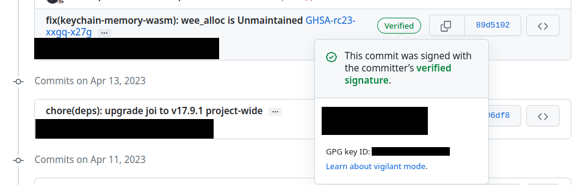

[//]: # (SPDX-License-Identifier: CC-BY-4.0)

# GitHub Contribution Guide

This document provides instructions to fork a Hyperledger repository and submit code contributions through a pull request.
Although there are many GitHub guides available, this guide covers the full set of contribution steps using generally accepted Hyperledger practices.

For additional Git/GitHub questions and discussions after reading this guide, reach out on the [git-help Discord channel](https://discord.com/channels/905194001349627914/1098621099681513492).

## Forking the repository

In order to contribute code to a Hyperledger project, it is required to fork the relevant GitHub repository and submit a pull request from your fork.
The act of forking a GitHub repository creates an identical copy of the repository in your personal GitHub account.
You are then able to edit code and propose these changes to the official Hyperledger repository you forked the code from via the GitHub pull request process.

To fork a repository:

- Navigate to the GitHub repository you wish to fork in your browser
- In the top right corner select the Fork button
- Accept the default fork options and select `Create Fork`
- Your browser will take you to the forked repository within your personal GitHub account

You can now clone your personal fork to your local machine.

## Cloning the repository and syncing with the upstream project

Once you have forked the repository you can now clone the project to your local machine to begin your development work.
This will create a local GitHub repository on your machine.

> Prerequisite: This guide uses GitHub\'s SSH protocol for cloning repositories.
> If you have not yet setup SSH access for GitHub please
> use the [GitHub guide](https://help.github.com/en/articles/connecting-to-github-with-ssh)
> to configure your SSH access.

To clone a repository:

- Open your terminal
- Navigate to the location on your local disk where you want to clone the repository
- Execute the following command to clone your fork

```
git clone git@github.com:<your_github_id>/<repository_name>.git
```

- Now change to the repository directory and add a remote upstream repository pointing to the official Hyperledger repository

```
cd <repository_name>
git remote add upstream https://github.com/hyperledger/<repository_name>.git
```

- You can now list your remote branches and confirm your local repository has created a link with the remote upstream repository

```
git remote -v
```

You have now cloned your forked repository and configured its upstream repository. You can now create a feature branch for development.

## Create a Local Feature Branch for Your Development work

To preserve the state of the existing branches in your forked repository and isolate your changes, use a feature branch in your forked repository.
A feature branch is created from an existing branch and is where you will perform your development work before pushing the changes back to your fork of the GitHub repository.
To create a feature branch, perform the following steps:

- Fetch the project branches from the upstream repository

```
git fetch upstream
```

- Checkout one of the existing branches

```
git checkout -t origin/main
```

- Rebase your main branch based on the upstream main branch (there are likely no changes required if you've just forked it, but we show the step here for completeness)

```
git rebase upstream/main
```

- Update your fork on GitHub with any changes from the upstream main

```
git push origin main
```

- You can now checkout a new local feature branch for your work, the feature branch will be an exact copy of the branch from which you created it.

```
git checkout -b <feature_branch_name>
```

Now that you have created a local feature branch, you can perform your updates.

## Committing and Pushing Changes to Your Forked Repository

Make the desired changes to files in your feature branch. You can now commit this code and push it to your forked repository:

- Add existing files you have changed to your commit by executing the following `git add` command
- The `-p` flag will open an interactive terminal for you to review and approve your changes before staging them for your commit.
- Alternatively, use the `-u` flag to stage all updated files for your commit.

```
git add -p
```

- Add any new files you have created by executing:

```
git add <file1> <file2>
```

- You can now create your commit containing the changes you just added.
- Your commit message should contain the following information:
  - A one line commit title summarizing the commit, followed by an empty line
  - A multi-line commit message body explaining the need for the change and how you approached it
  - A link to GitHub issue (if exists), using syntax like `Resolves #<GitHub issue number>` so that the GitHub issue gets linked to the pull request.
  - The `-s` flag will automatically sign the commit

```
git commit -s
```

- You can now push your local changes to your forked repository

```
git push origin <feature_branch_name>
```

Note - If you want to integrate upstream changes from the original repository
before pushing your changes see [Syncing Your Fork With the Upstream
Repository](#syncing-your-fork-with-the-upstream-repository).

You have now successfully pushed your local changes to your forked repository.
To integrate these changes you must now go through the pull request process.

## Opening a Pull Request in GitHub

Now that you've created and pushed changes to a feature branch in your forked repository,
you can now open a pull request against the original Hyperledger repository from which you created your fork and begin the code review process.

- Navigate to https://github.com/hyperledger/<original_repository>
- Select the Pull Request tab at the top of the page
- In the top right corner of the Pull Requests page, select New Pull Request
- On the Compare Changes page, select "compare across forks" at the top of the page
- Select the Hyperledger repository and branch that you want to merge into as the "base repository" and "base" branch
- Select your fork and your feature branch as the "head repository" and "compare" branch
- Select Create Pull Request
- You'll have the option to open your pull request as a Draft if you are not yet ready to have it reviewed.

Congratulations, you have now submitted your first pull request to a Hyperledger project.
Your pull request will now run through CI checks.
You can monitor your pull request CI progress by navigating to the Checks tab of the pull request.
If there are CI check failures the pull request may not get reviewed and merged.
Either resolve the failures by updating the pull request, or add a comment to the pull request to request help resolving the failure.

## Updating a Pull Request

As you receive review comments on your pull request (or if pull request checks fail), you may need to make edits to your commit.
In the local branch you are working from, you may make changes, amend the commit, and re-push to your remote feature branch.

```
git add -p
git commit --amend
git push origin <feature_branch_name> -f
```

This will update the pull request and re-trigger checks.

If you have created multiple commits locally that contain one logical change, it is typically best to squash them into a single final commit.
For example to squash your two most recent commits into a single commit before pushing:

```
git rebase -i HEAD~2
```

This will open an interactive dialog. Change the second (and any subsequent) commit action from \'pick\' to \'squash\' in the dialog.
The dialog will then present all the commit messages, which you can edit into a final message.

## Cherry-picking your pull request to other branches

After your PR is merged into the main branch, you need to consider whether it should be backported to earlier branches.
If the content is a new feature designated for the next release, obviously backporting is not appropriate.
But if it is a fix or update to an existing topic, don't forget to cherry-pick the PR back to earlier branches as needed.
When in doubt, consult the maintainer that merged the PR for advice.
Both parties should consider the backport and either party can trigger it.
You can use the GitHub cherry-pick command, or if the repository has the Mergify app enabled,
you can simply paste the following command as a comment in your PR after it is merged:

```
@Mergifyio backport <release-branch>
```

Replace <release-branch> with the branch that you want to backport to, for example, release-2.0.
If there are no merge conflicts, a new PR is automatically generated in that branch that still requires the normal approval process to be merged.
Remember to add a comment to the original PR for each branch that you want to backport to.

If there are merge conflicts, use the GitHub `cherry-pick` command instead, by providing the `SHA` from the commit in the main branch.

- The following example shows how to cherry-pick a commit from the main branch into the release-2.0 release branch:

```
git checkout release-2.0
```

- If your branch is behind, run the following command to update the branch based on the upstream branch:

```
git fetch upstream
git rebase upstream/release-2.0
git push origin release-2.0
```

- Create a new local branch to cherry-pick the content to and then cherry-pick the content by providing the SHA from the main branch.

```
git checkout -b <my2.0branch>
git cherry-pick <SHA from main branch>
```

- Resolve any merge conflicts and then push to your local branch.

```
git push origin <my2.0branch> 
```

- Now go to your browser and create a PR off of your local branch to the release-2.0 branch.

Your change has been cherry-picked back to the release-2.0 branch and can be approved and merged following the normal process.

## Cleaning Up Local And Remote Feature branches

Once you have completed work on a feature branch and the changes have been merged,
you should delete the local and remote feature branches as they are no longer valid to build on.
You can delete them by executing the following commands:

```
git branch -d <feature_branch_name>
git push --delete origin <feature_branch_name>
```

## Syncing Your Fork With the Upstream Repository

As your development progresses, invariably new commits will be merged
into the original project from which your forked repo was generated from.
To avoid surprise merge conflicts you should integrate these changes into your local repository.
To integrate changes from the upstream repository, assuming you are currently in your local main branch,
execute the following commands from the root of your repository:

```
git fetch upstream
git rebase upstream/main
```

Syncing your fork only updates your local repository,
you will need to push these updates to your forked repository to save them using the following command:

```
git push origin main
```

## Git Commit Signatures (not sign-off messages)

When merging someone else's pull request where they had GPG signed their commits, try to preserve GPG signatures where possible, but not at the expense of abandoning the principle of keeping a linear commit history.

In practice this means that if a pre-merge rebase is necessary (for ensuring linear commit history), it must be done by the contributor of the pull request, so that they can re-sign the new commit (which usually has the same diff, but cryptographically speaking a completely different commit, e.g. different commit hash)

If you are a maintainer who is merging a pull request that is both:

1. up to date with the target branch **and**
2. the commit of it is signed

then you can follow these steps below to ensure that the final commit on the target branch has the same hash and signature as the one made by the contributor originally. This is useful/important if you want to make sure that commit verification can be done on the commit graph.

Assuming that:
1. The target branch is called `main`
2. You have the official repo added as a remote called `upstream` (e.g. you've done something like `git remote add upstream https://github.com/hyperledger/cacti.git`)
3. The pull request branch is called `the_pr_branch`
4. The remote of the fictional contributor called Example Person who opened the pull request has been added with the name of `example_remote`

First we fetch all remotes and ensure that our own main branch is up to date with the upstream main branch.

```sh
git fetch --all
git switch main
git rebase upstream/main
git push --force-with-lease
```

Then we perform the actual merging of `the_pr_branch` into `main`

```sh
git merge --ff-only example_remote/the_pr_branch
git push upstream
```

At this point the `main` branch's commit log on GitHub should show the commit of the pull request with a matching hash and also with the signature verification checkmark (as long as the signature was there on the original commit)



If you are a maintainer who is merging a pull request that has a signed commit but is NOT up to date with the target branch, your only option is to ask the contributor to perform a rebase of their branch onto the target branch and re-sign the commit at the same time.
Once they had done that, you can execute the steps above in the previous paragraph.

### Reading List for Git Commit Signing in General

1. https://git-scm.com/book/en/v2/Git-Tools-Signing-Your-Work
2. https://docs.github.com/en/authentication/managing-commit-signature-verification/about-commit-signature-verification
