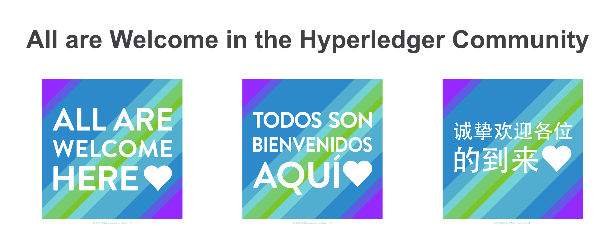

Hyperledger is committed to creating a safe and welcoming community for all. For more information please visit our Code of Conduct: [Hyperledger Code of Conduct](https://toc.hyperledger.org/governing-documents/code-of-conduct.html)

## Announcements

* The [Hyperledger /dev/weekly developer newsletter](https://wiki.hyperledger.org/pages/viewpage.action?pageId=39618905) goes out each Friday to hundreds of Hyperledger developers. It is a collaborative effort. If you have a project release, pull request, community event, and/or relevant article you would like highlighted next week, please [leave a comment for consideration on the upcoming newsletter wiki page](https://wiki.hyperledger.org/display/DR/2023)

## Quarterly reports

- 2022 Q4 Hyperledger Ursa (due 01 Dec 2022)
- Please review any [outstanding quarterly reports](https://github.com/hyperledger/toc/pulls?q=is%3Apr+is%3Aopen+label%3Aquarterly-report+user-review-requested%3A%40me).

## Upcoming reports

- 2023 Q1 Hyperledger Sawtooth (due 26 Jan 2023)
- [2023 Q1 Hyperledger Aries](2023-Q1-Hyperledger-Aries_80776052.html) (due 02 Feb 2023)
- 2023 Q1 Hyperledger Indy (due 02 Feb 2023)
- 2023 Q1 Hyperledger AnonCreds (due 02 Feb 2023)
- [2023 TOC Project Update Calendar](https://wiki.hyperledger.org/display/TSC/2023+TOC+Project+Update+Calendar)

## Decision

- [Move Project Reports to Github](https://github.com/hyperledger/toc/issues/43)

## Discussion

- Proposed Task Forces based on our goals discussion. Prioritize and
  confirm chairs.
  - Best Practices for Automated Pipelines

    - how to produce and publish artifacts

  - Project Best Practices

    - gather current best practices
    - determine gaps

  - Badging/Lifecycle

  - Documentation

    - Common styling
    - Common publishing platform
    - Best practices for creating documentation, including information
      on tooling and the audiences
    - Create a template repo

  - Onboarding
    - SIG Chairs

    - TOC members

    - Maintainers

    - Developers/Users

    - Contributors

    - Citizens (community members)

  - Supported Project

    - Related to Hyperledger, but maybe not blockchain (ZKP, for
      instance)

  - Security - Vulnerability disclosure

    - Document default template for vulnerability disclosure processes
      for Hyperledger projects

  - Security - Artifact signing

  - Others?

## Project Proposals (from hyperledger/hyperledger-hips)

  - [HLF Operator](https://github.com/hyperledger/hyperledger-hip/pull/8) opened Nov 14, 2022 by [dviejokfs](https://github.com/dviejokfs")

## Backlog (from hyperledger/toc)

  - [Update to the security process for Hyperledger](https://github.com/hyperledger/toc/issues/20) opened Nov 11, 2021 by [Ry Jones](https://github.com/ryjones)

## Recordings

* [https://youtu.be/dwzEvSgJioU](https://youtu.be/dwzEvSgJioU)

## Attended by:

* [x] Arnaud J Le Hors
* [x] Arun S M
* [x] Bobbi Muscara
* [x] David Enyeart
* [x] Jim Zhang
* [x] Marcus Brandenburger
* [ ] ~~Peter Somogyvari~~
* [x] Ramakrishna V
* [x] Stephen Curran
* [x] Timo Glastra
* [x] Tracy Kuhrt
