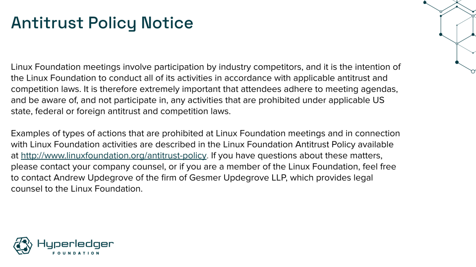

Hyperledger is committed to creating a safe and welcoming community for all. For more information please visit our Code of Conduct: [Hyperledger Code of Conduct](https://toc.hyperledger.org/governing-documents/code-of-conduct.html)

# Announcements
* The [Hyperledger /dev/weekly developer newsletter](https://wiki.hyperledger.org/pages/viewpage.action?pageId=39618905) goes out each Friday to hundreds of Hyperledger developers. It is a collaborative effort. If you have a project release, pull request, community event, and/or relevant article you would like highlighted next week, please [leave a comment for consideration on the upcoming newsletter wiki page](https://wiki.hyperledger.org/display/DR/2023).

# Quarterly reports
* [2023 Q2 Hyperledger Sawtooth](https://github.com/hyperledger/toc/pull/128) - Dave has [requested updates in the PR](https://github.com/hyperledger/toc/pull/128#issuecomment-1643997198); Jim has also [requested changes in the PR](https://github.com/hyperledger/toc/pull/128#discussion_r1269564288)
* [2023 Q3 Hyperledger Sawtooth](https://github.com/hyperledger/toc/pull/142)
* Please review any [outstanding quarterly reports](https://github.com/hyperledger/toc/pulls?q=is%3Apr+is%3Aopen+label%3Aquarterly-report+user-review-requested%3A%40me).

# Past due reports
* None

# Upcoming reports
* 2023 Q3 Hyperledger AnonCreds (due August 3, 2023)
* 2023 Q3 Hyperledger Aries (due August 3, 2023)
* 2023 Q3 Hyperledger Indy (due August 3, 2023)
* [2023 TOC Project Update Calendar](../../project-reports/2023/2023-updates.md)

# Discussion
* [Security Policy](https://github.com/hyperledger/toc/pull/143)

# Recordings
* Links to be added upon completion of call

# Upcoming TOC meetings
* [Please check the calendar](https://lists.hyperledger.org/g/toc/calendar)
* Next week task force: Badging/Project Lifecycle

# Attended by
* [ ] Arnaud J Le Hors
* [ ] Arun S M
* [ ] Bobbi Muscara
* [ ] David Enyeart
* [ ] Jim Zhang
* [ ] Marcus Brandenburger
* [ ] Peter Somogyvari
* [ ] Ramakrishna V
* [ ] Stephen Curran
* [ ] Timo Glastra
* [ ] Tracy Kuhrt
