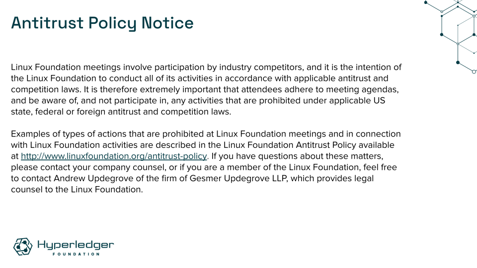
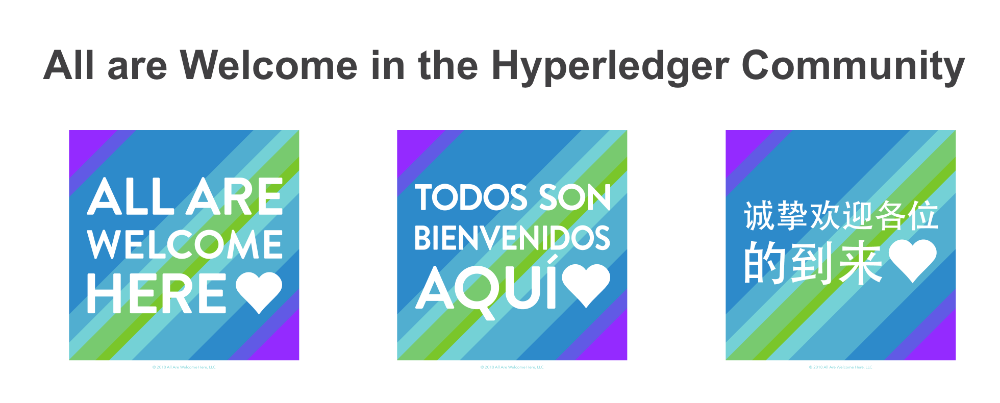

Hyperledger is committed to creating a safe and welcoming community for all. For more information please visit our Code of Conduct: [Hyperledger Code of Conduct](https://toc.hyperledger.org/governing-documents/code-of-conduct.html)

# Announcements
* The [Hyperledger /dev/weekly developer newsletter](https://wiki.hyperledger.org/pages/viewpage.action?pageId=39618905) goes out each Friday to hundreds of Hyperledger developers. It is a collaborative effort. If you have a project release, pull request, community event, and/or relevant article you would like highlighted next week, please [leave a comment for consideration on the upcoming newsletter wiki page](https://wiki.hyperledger.org/display/DR/2023).
* The TOC meetings of December 21, December 28, and January 4 are cancelled.

# Quarterly reports
* [2023 Q4 Hyperledger Bevel](https://github.com/hyperledger/toc/pull/186)
* [2023 Q4 Hyperledger Solang](https://github.com/hyperledger/toc/pull/187)
* Please review any [outstanding quarterly reports](https://github.com/hyperledger/toc/pulls?q=is%3Apr+is%3Aopen+label%3Aquarterly-report+user-review-requested%3A%40me).

# Past due reports
* 2023 Q4 Hyperledger Transact (due November 23, 2023) -- Dormant project - should we move to EOL?
* 2023 Q4 Hyperledger Cello (due November 30, 2023)

# Upcoming reports
* 2023 Q4 Hyperledger Besu (due December 7, 2023)
* 2023 Q4 Hyperledger Caliper (due December 7, 2023)
* 2023 Q4 Hyperledger FireFly (due December 7, 2023)
* [2023 TOC Project Update Calendar](../../project-reports/2023/2023-updates.md)

# Discussion
* [TOC 2023 Retrospective](https://docs.google.com/presentation/d/126hBqWstyWl1UhzsR52cy1kqNtp6NYPrdzkhdSIRc5Q/edit?usp=sharing)
* [Hyperledger Fabric Ecosystem](https://wiki.hyperledger.org/display/fabric/Ecosystem)

# Recordings
* Links to be added upon completion of call

# Upcoming TOC meetings
* [Please check the calendar](https://lists.hyperledger.org/g/toc/calendar)

# Attended by
* [ ] Arnaud J Le Hors
* [ ] Arun S M
* [ ] Bobbi Muscara
* [ ] David Enyeart
* [ ] Jim Zhang
* [ ] Marcus Brandenburger
* [ ] Peter Somogyvari
* [ ] Ramakrishna V
* [ ] Stephen Curran
* [ ] Timo Glastra
* [ ] Tracy Kuhrt

