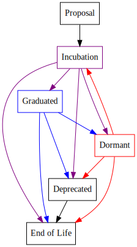

[//]: # (SPDX-License-Identifier: CC-BY-4.0)

# Project Lifecycle

The term "project" within Hyperledger will refer to a
collaborative endeavor to deliver a work item.
There may be some projects that are intended to produce a document, such
as a requirements or use cases document, a whitepaper, or analysis.
Others may be to develop a new capability, or refactor (or remove) an
existing capability for the Hyperledger technology releases. Such
projects may take the form of a new component (e.g. a new repository) or
may propose additions, deletions or changes to an existing
repository(s).

Many other open source initiatives leverage an incubation process for
new work items, and this seems to have a desired effect of encouraging
new ideas and tracks of work, while at the same time providing clear
guidance to the broader community as to what is real and supported,
versus what is still in the exploratory/experimental/developmental
phases.

Therefore Hyperledger has adopted a similar lifecycle process as
follows:

.

Projects are in one of six possible states:

-   [*Proposal*](#proposal)
-   [*Incubation*](#incubation)
-   [*Graduated*](#graduated)
-   [*Dormant*](#dormant)
-   [*Deprecated*](#deprecated)
-   [*End of Life*](#end-of-life)

Projects may not necessarily move through those states in a linear way
and may go through several iterations.

# Proposal

Project Proposals shall be submitted to the [TSC](https://www.hyperledger.org/about/leadership)
for review, using [Proposal Template](https://hyperledger.github.io/hyperledger-hip/).
Proposals that are approved shall enter into an *Incubation* state, unless
they are of a refactoring nature, in which case they will be turned over
to the relevant project maintainer(s) to handle as they deem fit.

A Proposal must:

-   have a clear description
-   have a well-defined scope
-   identify committed development resources
-   identify initial maintainers
-   be vendor neutral

# Incubation

Approved project proposals enter into *Incubation*. For new
components/modules, a repository will be created under the
[Hyperledger Github org](https://github.com/hyperledger)
and optionally in [JIRA](https://jira.hyperledger.org), if requested. New
features/capabilities should be handled through pull requests labeled
with tags that identify the project and tag it as
*incubator* (and will ideally be capable of being enabled/disabled with feature-flags).

Projects in *Incubation* may overlap with one another.
Entering *Incubation* is meant to be fairly easy to allow for
community exploration of different ideas.

Once a project qualifies to be declared *Graduated*, the
*project*\'s maintainers can then vote to request a graduation
review by the TSC.

Entering *Incubation* does not guarantee that the project will
eventually get to *Graduated* state. Projects may never get
to *Graduated* state.

Projects seeking to graduate from *Incubation* must meet
the criteria defined in the 
[Incubation Exit Criteria](./project-incubation-exit.md) document.

# Graduated

(Formerly called 'Active') 

Projects that have successfully exited the *Incubation* phase
are in the *Graduated* phase.

# Dormant

Projects in the *Dormant* state are ones in which the normal functions are
suspended or slowed down for a period of time. The TSC will make the decision
as to whether a project will move to or from the *Dormant* state upon request.
If *Dormant* projects become re-activated, they will re-enter the *Incubation*
state even if they entered the *Dormant* state from the *Graduated* state.

# Deprecated

Anyone may propose that a project be *Deprecated*, by submitting a
rationale and identifying a substitute project/component (if any). The
maintainers of the project shall vote on such a request and if it
passes, make that recommendation to the TSC. Members of the community
that disagree with the request shall make their case before the TSC. The
TSC shall consider all points of view and render a final decision to
deprecate or not.

A *Deprecated* project will be maintained for a six month
period by its community, after which it will be removed from any
subsequent formal releases. Notice will be given to the public of the
project\'s deprecation. After the six-month deprecation
period, the project will be labeled *End of Life*.

# End of Life

A project that is no longer actively developed or maintained.

