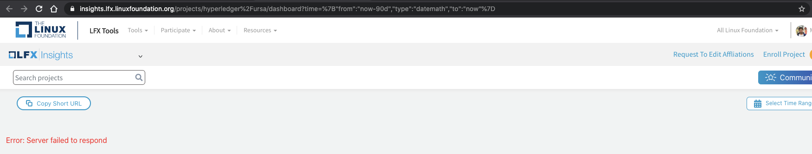

# 2020 Q4 Hyperledger Ursa

Created by Hart Montgomery, last modified by Gari Singh on Feb 05, 2021

# Project

This report covers Hyperledger Ursa.  We apologize for the fact
that it is late.  This can be blamed on @hartm for those looking for a
reason. 

# Project Health

Ursa is reasonably healthy right now.  The bad news:  we have lost some
contributors and interest from the Indy ecosystem.  This is mostly
because these contributors are happy with the current features that Ursa
provides and don't feel the need to improve them, so this isn't a wholly
negative thing.  We expect these kinds of contributions to wax and wane,
so it's not a truly negative thing, but it does show up in our project
metrics.  The good news:  Philip and Mikaela from Scoir, who are
relatively new contributors, have done great work on a Go interface from
Ursa.  We encourage the projects that heavily use Go to check out
ursa-wrapper-go and see for themselves.

In sum, we could always use more contributors, but it's hard to find
cryptographers and cryptographic engineers, so we expect our core group
to not be too huge.

# Questions/Issues for the TSC

We say something like this in pretty much every report, but we want to
reiterate that w e are always
interested in getting in touch with others who want to use cryptography,
and particularly so for people that want to use non-standardized crypto
like threshold signatures or zero knowledge proofs.  If this describes
you, please feel free to get in touch with us. 

Yes, that was a cut and paste, and yes, we will continue to post it. 
Please talk to us!

# Releases

We have had three releases from ursa-wrapper-go since our last report. 
In particular, v0.1, v0.2, and v0.3 have been released (with v0.3 just
recently released two days ago).  In particular, v0.3 does a full round
trip of Indy credentials.  Thank you Philip and Mikaela for all your
hard work on this!

We didn't have a core Ursa crate this quarter, but expect to release in
the not too distant future.  We have a lot of new features that we want
to include (see below).

# Overall Activity in the Past Quarter

We had two major foci of activity in the past quarter:

1. We have a Go interface!  Thanks go to Philip and Mikaela.  It's
right now focused on Indy credentials, but is certainly extensible.
2. We added code to our core Rust library that handles a variety of
secret sharing cases.  Thanks Mike!  While secret sharing itself is
not widely used by itself, it is used as a tool for many different
kinds of threshold cryptography, which is where we expect to use it.

# Current Plans

We have a number of things on our docket.  In addition to continuing
existing work, we are doing the following:

1. Perhaps most notably, we are doing a large reorganization.  All of
our "fancy" crypto was structured in the form of a library we called
zmix, which was originally designed to be an extensible zero
knowledge proof system.  However, the people that designed that,
while excellent, moved on from Ursa a while ago.  In the meantime,
people have used Ursa in different ways than the zmix design
originally anticipated.  As such, we are rearchitecting Ursa to
better reflect how people are actually using Ursa today.  Mike and
Brent, in particular, have done a great job getting this going.
2. We anticipate including new schemes for revocable credentials in
Ursa next quarter.  This contains some of the most complicated
crypto we've included in Ursa to this point.  Thanks again to Mike!
3. We plan on streamlining our signature interface for more modular
signatures.
4. Threshold signatures.  We've been meaning to do this for a long
time, and hopefully now that we have secret sharing implementations
that can be used for the initial key distribution, we can make good
progress.

# Maintainer Diversity

<u>New Maintainers:</u>

- Mikaela Tarkocheva (Scoir)
- Philip Feairheller (Scoir)

<u>Current (Old) Maintainers:</u>

- Mike Lodder (Independent)
- Brent Zundel (Evernym Inc.)
- Dave Huseby (Linux Foundation)
- Hart Montgomery (Fujitsu)
- Dan Middleton (Intel)
- Cam Parra (Kiva)
- Dan Anderson (Intel)
- Jon Geater (Jitsuin)

Some of these maintainers are obviously more active than others.

# Contributor Diversity

Here is the relevant link from LF Analytics:   <a href="https://insights.lfx.linuxfoundation.org/projects/hyperledger%2Fursa/dashboard?time=%7B%22from%22:%22now-90d%22,%22type%22:%22datemath%22,%22to%22:%22now%22%7D" class="external-link" rel="nofollow">https://insights.lfx.linuxfoundation.org/projects/hyperledger%2Fursa/dashboard?time=%7B%22from%22:%22now-90d%22,%22type%22:%22datemath%22,%22to%22:%22now%22%7D</a>

The TL;DR is that overall contributions are about static, core
contributions are down a little bit, and wrapper contributions are up
(thanks Philip and Mikeala!).

While the project continues to move along, we do not have enough
diversity to apply for active status at this point in time. 
Cryptographers and good cryptographic engineers are hard to find.

# Additional Information

Since Mic Bowman is less involved in Hyperledger these days, we need to
offer up another human sacrifice to the dunking booth in order to
appease the gods of open source software.  We would like to propose Dan
Middleton, although of course we would be happy to consider TSC
feedback.

In all seriousness, thanks for reading if you've made it this far and
feel free to ask us questions.  Sorry again for the late
report! 

# Reviewed By

- ✅ 
<a href="https://wiki.hyperledger.org/display/~angelo.decaro" class="confluence-userlink user-mention" data-username="angelo.decaro" data-linked-resource-id="16327529" data-linked-resource-version="1" data-linked-resource-type="userinfo" data-base-url="https://wiki.hyperledger.org">Angelo De Caro</a>
- ✅ 
<a href="https://wiki.hyperledger.org/display/~lehors" class="confluence-userlink user-mention" data-username="lehors" data-linked-resource-id="2394240" data-linked-resource-version="1" data-linked-resource-type="userinfo" data-base-url="https://wiki.hyperledger.org">Arnaud J Le Hors</a>
- ✅ 
<a href="https://wiki.hyperledger.org/display/~arsulegai" class="confluence-userlink user-mention" data-username="arsulegai" data-linked-resource-id="6427759" data-linked-resource-version="2" data-linked-resource-type="userinfo" data-base-url="https://wiki.hyperledger.org">Arun S M</a> 
- ✅ 
<a href="https://wiki.hyperledger.org/display/~baohua" class="confluence-userlink user-mention" data-username="baohua" data-linked-resource-id="2393082" data-linked-resource-version="2" data-linked-resource-type="userinfo" data-base-url="https://wiki.hyperledger.org">Baohua Yang</a> 
- ✅ 
<a href="https://wiki.hyperledger.org/display/~Bobbijn" class="confluence-userlink user-mention" data-username="Bobbijn" data-linked-resource-id="2393198" data-linked-resource-version="2" data-linked-resource-type="userinfo" data-base-url="https://wiki.hyperledger.org">Bobbi Muscara</a>
- ✅ 
<a href="https://wiki.hyperledger.org/display/~shemnon" class="confluence-userlink user-mention" data-username="shemnon" data-linked-resource-id="20022118" data-linked-resource-version="2" data-linked-resource-type="userinfo" data-base-url="https://wiki.hyperledger.org">Danno Ferrin</a>
- ✅ 
<a href="https://wiki.hyperledger.org/display/~denyeart" class="confluence-userlink user-mention" data-username="denyeart" data-linked-resource-id="2392864" data-linked-resource-version="1" data-linked-resource-type="userinfo" data-base-url="https://wiki.hyperledger.org">David Enyeart</a>
- ✅ 
<a href="https://wiki.hyperledger.org/display/~mastersingh24" class="confluence-userlink user-mention" data-username="mastersingh24" data-linked-resource-id="16321659" data-linked-resource-version="1" data-linked-resource-type="userinfo" data-base-url="https://wiki.hyperledger.org">Gari Singh</a> 
- ✅ 
<a href="https://wiki.hyperledger.org/display/~grace.hartley" class="confluence-userlink user-mention" data-username="grace.hartley" data-linked-resource-id="16324128" data-linked-resource-version="1" data-linked-resource-type="userinfo" data-base-url="https://wiki.hyperledger.org">Grace Hartley</a>
- ✅ 
<a href="https://wiki.hyperledger.org/display/~hartm" class="confluence-userlink user-mention" data-username="hartm" data-linked-resource-id="6422922" data-linked-resource-version="1" data-linked-resource-type="userinfo" data-base-url="https://wiki.hyperledger.org">Hart Montgomery</a>
- ✅ 
<a href="https://wiki.hyperledger.org/display/~mtng" class="confluence-userlink user-mention" data-username="mtng" data-linked-resource-id="24779370" data-linked-resource-version="1" data-linked-resource-type="userinfo" data-base-url="https://wiki.hyperledger.org">Maria Teresa Nieto</a>
- 🔲 
<a href="https://wiki.hyperledger.org/display/~mwagner" class="confluence-userlink user-mention" data-username="mwagner" data-linked-resource-id="5505170" data-linked-resource-version="1" data-linked-resource-type="userinfo" data-base-url="https://wiki.hyperledger.org">Mark Wagner</a> 
- ✅ 
<a href="https://wiki.hyperledger.org/display/~nage" class="confluence-userlink user-mention" data-username="nage" data-linked-resource-id="2393038" data-linked-resource-version="1" data-linked-resource-type="userinfo" data-base-url="https://wiki.hyperledger.org">Nathan George</a>
- ✅ 
<a href="https://wiki.hyperledger.org/display/~tkuhrt" class="confluence-userlink user-mention" data-username="tkuhrt" data-linked-resource-id="1180151" data-linked-resource-version="2" data-linked-resource-type="userinfo" data-base-url="https://wiki.hyperledger.org">Tracy Kuhrt</a> 
- 🔲 
<a href="https://wiki.hyperledger.org/display/~troyronda" class="confluence-userlink user-mention" data-username="troyronda" data-linked-resource-id="9110618" data-linked-resource-version="2" data-linked-resource-type="userinfo" data-base-url="https://wiki.hyperledger.org">Troy Ronda</a> 

## Comments:

<table data-border="0" width="100%">
<colgroup>
<col style="width: 100%" />
</colgroup>
<tbody>
<tr class="odd">
<td>

Q1: On the current plans, does Ursa community maintain a backlog of
items in a tracker tool? It's long time due for me to be involved
personally.

Q2: The link pasted on the LF analytics gives me an error. Here's
what I see, probably there's a different way to get the shareable
link?

I like the way you write the reports. Walking readers to the end of
it with the same amount of curiosity 

 Posted by arsulegai at Dec 27, 2020 11:59 
</td>
</tr>
<tr class="even">
<td style="border-top: 1px dashed #666666">

Q1:  We have an RFC list ( <a href="https://github.com/hyperledger/ursa-rfcs/" class="external-link" rel="nofollow">https://github.com/hyperledger/ursa-rfcs/</a> ), an
issues list ( <a href="https://github.com/hyperledger/ursa/issues" class="external-link" rel="nofollow">https://github.com/hyperledger/ursa/issues</a> ) and a
roadmap that is usually a little out of date ( <a href="https://github.com/hyperledger/ursa/issues/133" class="external-link" rel="nofollow">https://github.com/hyperledger/ursa/issues/133</a> ).  We
don't have good backlog or tracking tools yet, probably because our
community is still relatively small and it's pretty clear in advance who
needs to do what.  This is something we should certainly fix though. 
And we'd love to have you involved personally!

Q2:  That's weird.  The link works fine for me.  You may just want to
try clicking through the menus on the LF analytics site then.

Comment: I'm glad you like them!  Thank you for the compliment.

Posted by hartm at Dec
28, 2020 21:04 
</td>
</tr>
<tr class="odd">
<td style="border-top: 1px dashed #666666">

"we do not have enough diversity to apply for active status at this
point in time"

Is it really so though? Looking at the list of maintainers it seems
to me that you have more diversity than many other projects. Is it th"at the list doesn't say the whole story or is it just that you are too shy?

 

Posted by lehors at Jan
06, 2021 14:36 
</td>
</tr>
<tr class="even">
<td style="border-top: 1px dashed #666666">

I was thinking the same thing. It looks pretty diverse based on the
maintainer list.

Posted by tkuhrt at Jan
06, 2021 14:50 
</td>
</tr>
<tr class="odd">
<td style="border-top: 1px dashed #666666">

We have a lot of maintainers, but the contributions are distributed
very unequally.  We are too dependent on a number of people (i.e. Mike
Lodder) for active status to make sense at this point.

Posted by hartm at Jan
06, 2021 14:52 
</td>
</tr>
</tbody>
</table>

