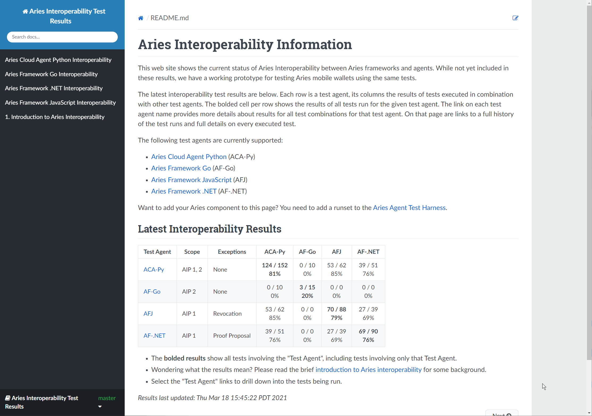

# 2021 Q2 Hyperledger Aries

Created by Stephen Curran, last modified by Tracy Kuhrt on May 25, 2021

# Project Health

The Aries Project transitioned to "Active" in the last quarter,
reflecting the project's current community state. Lots of active
discussion, activity and growth internally, and a lot of external
interest in the project and artifacts from the deliverables.

# Questions/Issues for the TSC

A discussion is happening email with 
<a href="https://wiki.hyperledger.org/display/~bbehlendorf" class="confluence-userlink user-mention" data-username="bbehlendorf" data-linked-resource-id="2392191" data-linked-resource-version="1" data-linked-resource-type="userinfo" data-base-url="https://wiki.hyperledger.org">Brian Behlendorf</a> and
leaders in the Ursa community about how to get an audit report on Ursa
and it's use in Aries and Indy. That is progressing, but it's a tricky
subject, so any help from the TSC on moving the effort forward would be
appreciated.

# Releases

The following releases occurred in the last quarter:

-   Aries Cloud Agent Python Release 0.6.0
-   Aries Framework Go Release 0.1.6
-   Aries Framework JavaScript – multiple "unstable" releases that are
leading up to the 0.0.1 release
-   Aries Askar 0.1.3
-   Aries VCX Releases 0.16.0, 0.17.0, 0.17.1

We expect that we'll get to designated "1.0.0" releases in the next few
months for some of the sub-projects.

The Aries Agent Test Harness continued to evolve with the launch of a
status page about the state of Aries interoperability –
<a href="https://aries-interop.info" class="external-link" rel="nofollow">https://aries-interop.info</a> . As well, a mechanism was
added to allow for the testing of mobile agents using the Aries Agent
Test Harness, so that interop between frameworks as issuers and
verifiers and mobile agents as holders.

# Overall Activity in the Past Quarter

Per the  <a href="https://insights.lfx.linuxfoundation.org/projects/hyperledger%2Faries/dashboard?time=%7B%22from%22:%222021-01-01T00:00:00.000Z%22,%22type%22:%22absolute%22,%22to%22:%222021-03-31T23:59:59.254Z%22%7D" class="external-link" rel="nofollow">Aries Activity Dashboard</a> for
the first quarter of 2021, Aries codebases had 696 commits in 549 PRs
from 53 contributors.

Community participation is extremely active in rocketchat channels,
community calls, and repo PR reviews and issues. Email lists are less
frequently used.

Coordination with the DIF DIDComm working group is healthy, with regular
reports being shared.

Project work in main repos is healthy and active.

# Current Plans

-   AIP 2.0 is very (very!) close to completion, with key additions to
make Aries ledger agnostic and to add the use of new verifiable
credential formats in W3C Standard format.
-   Lots of work is proceeding as the discussions about AIP 2.0
continue.
-   Work is active to extend Aries beyond support just Indy ledgers and
Indy AnonCred verifiable credentials to supporting other ledgers and
other verifiable credential formats – most notably BBS+ signatures,
supporting ZKPs and selective disclosure.
-   AF-Go has working code
-   ACA-Py has works in progress (as of the end of 2021-Q1) on
multi-ledger resolution and verifiable credential formats.
-   The Aries Mobile Agent React Native (aka Bifold) built on Aries
Framework JavaScript has gained some traction and could be the open
source wallet a larger community rallied behind.
-   Interoperability testing continues to be a key focus.

# Maintainer Diversity

Aries is a multi-codebase effort, and each codebase has its own set of
maintainers. The diversity of maintainers closely matches contributors,
with notes below.  Cross framework collaboration is increasing. For
example, work is happening on interop testing capabilities across the
Python, Go, .NET and JavaScript frameworks.

As interest in verifiable credentials has increased with COVID-19 use
cases (proof of testing, proof of immunization and mobile medical
workforces), interest and attendance has increased, as have deployments
of Aries-based implementations.

# Contributor Diversity

In addition to the code contribution statistics (above), here are a few
indicators of our current diversity:

-   We hold two community calls on Wednesdays: weekly at noon Pacific to
cover US and Pacific contributors, and biweekly at 7am Pacific to
cover US and European contributors.
-   Call attendance for each is typically in the 15-20 range.
-   Most organizations have only one attendee; it is rare for more than
3 to attend from the same organization.
-   Cross codebase interoperability efforts indicate cross-organization
cooperation.

# Additional Information

Related activity to Aries is occurring in
<a href="https://identity.foundation/" class="external-link" rel="nofollow">DIF</a> (Decentralized Identity Foundation), the
<a href="https://trustoverip.org/" class="external-link" rel="nofollow">Trust over IP Foundation</a> , and especially in their <a href="https://wiki.trustoverip.org/pages/viewpage.action?pageId=73790" class="external-link" rel="nofollow">Good Health Pass</a> initiative,
and in <a href="https://www.lfph.io/" class="external-link" rel="nofollow">Linux Foundation Public Health</a> (LFPH).

# Reviewed by
-   ✅ <a href="https://wiki.hyperledger.org/display/~angelo.decaro" class="confluence-userlink user-mention" data-username="angelo.decaro" data-linked-resource-id="16327529" data-linked-resource-version="1" data-linked-resource-type="userinfo" data-base-url="https://wiki.hyperledger.org">Angelo De Caro</a>
-   ✅ <a href="https://wiki.hyperledger.org/display/~lehors" class="confluence-userlink user-mention" data-username="lehors" data-linked-resource-id="2394240" data-linked-resource-version="1" data-linked-resource-type="userinfo" data-base-url="https://wiki.hyperledger.org">Arnaud J Le Hors</a>
-   ✅ <a href="https://wiki.hyperledger.org/display/~arsulegai" class="confluence-userlink user-mention" data-username="arsulegai" data-linked-resource-id="6427759" data-linked-resource-version="2" data-linked-resource-type="userinfo" data-base-url="https://wiki.hyperledger.org">Arun S M</a>
-   ✅ <a href="https://wiki.hyperledger.org/display/~baohua" class="confluence-userlink user-mention" data-username="baohua" data-linked-resource-id="2393082" data-linked-resource-version="2" data-linked-resource-type="userinfo" data-base-url="https://wiki.hyperledger.org">Baohua Yang</a>
-   ✅ <a href="https://wiki.hyperledger.org/display/~Bobbijn" class="confluence-userlink user-mention" data-username="Bobbijn" data-linked-resource-id="2393198" data-linked-resource-version="2" data-linked-resource-type="userinfo" data-base-url="https://wiki.hyperledger.org">Bobbi Muscara</a>
-   ✅ <a href="https://wiki.hyperledger.org/display/~denyeart" class="confluence-userlink user-mention" data-username="denyeart" data-linked-resource-id="2392864" data-linked-resource-version="1" data-linked-resource-type="userinfo" data-base-url="https://wiki.hyperledger.org">David Enyeart</a>
-   ✅ <a href="https://wiki.hyperledger.org/display/~mastersingh24" class="confluence-userlink user-mention" data-username="mastersingh24" data-linked-resource-id="16321659" data-linked-resource-version="1" data-linked-resource-type="userinfo" data-base-url="https://wiki.hyperledger.org">Gari Singh</a>
-   🔲 <a href="https://wiki.hyperledger.org/display/~grace.hartley" class="confluence-userlink user-mention" data-username="grace.hartley" data-linked-resource-id="16324128" data-linked-resource-version="1" data-linked-resource-type="userinfo" data-base-url="https://wiki.hyperledger.org">Grace Hartley</a>
-   ✅ <a href="https://wiki.hyperledger.org/display/~8a9ebdad74c3ca030175df13fdb500d7" class="confluence-userlink user-mention" data-username="8a9ebdad74c3ca030175df13fdb500d7" data-linked-resource-id="62239223" data-linked-resource-version="1" data-linked-resource-type="userinfo" data-base-url="https://wiki.hyperledger.org">user-74455</a>
-   ✅ <a href="https://wiki.hyperledger.org/display/~hartm" class="confluence-userlink user-mention" data-username="hartm" data-linked-resource-id="6422922" data-linked-resource-version="1" data-linked-resource-type="userinfo" data-base-url="https://wiki.hyperledger.org">Hart Montgomery</a>
-   ✅ <a href="https://wiki.hyperledger.org/display/~mwagner" class="confluence-userlink user-mention" data-username="mwagner" data-linked-resource-id="5505170" data-linked-resource-version="1" data-linked-resource-type="userinfo" data-base-url="https://wiki.hyperledger.org">Mark Wagner</a>
-   ✅ <a href="https://wiki.hyperledger.org/display/~mtng" class="confluence-userlink user-mention" data-username="mtng" data-linked-resource-id="24779370" data-linked-resource-version="1" data-linked-resource-type="userinfo" data-base-url="https://wiki.hyperledger.org">Maria Teresa Nieto</a>
-   ✅ <a href="https://wiki.hyperledger.org/display/~nage" class="confluence-userlink user-mention" data-username="nage" data-linked-resource-id="2393038" data-linked-resource-version="1" data-linked-resource-type="userinfo" data-base-url="https://wiki.hyperledger.org">Nathan George</a>
-   ✅ <a href="https://wiki.hyperledger.org/display/~tracy" class="confluence-userlink user-mention" data-username="tracy" data-linked-resource-id="2392240" data-linked-resource-version="1" data-linked-resource-type="userinfo" data-base-url="https://wiki.hyperledger.org">Tracy Kuhrt</a>
-   ✅ <a href="https://wiki.hyperledger.org/display/~troyronda" class="confluence-userlink user-mention" data-username="troyronda" data-linked-resource-id="9110618" data-linked-resource-version="2" data-linked-resource-type="userinfo" data-base-url="https://wiki.hyperledger.org">Troy Ronda</a>

## Comments:

<table data-border="0" width="100%">
<colgroup>
<col style="width: 100%" />
</colgroup>
<tbody>
<tr class="odd">
<td>

<a href="https://wiki.hyperledger.org/display/~bbehlendorf" class="confluence-userlink user-mention" data-username="bbehlendorf" data-linked-resource-id="2392191" data-linked-resource-version="1" data-linked-resource-type="userinfo" data-base-url="https://wiki.hyperledger.org">Brian Behlendorf</a> is
there an actionable item we can help with?

 Posted by arsulegai at May 15, 2021 11:11 
</td>
</tr>
</tbody>
</table>

