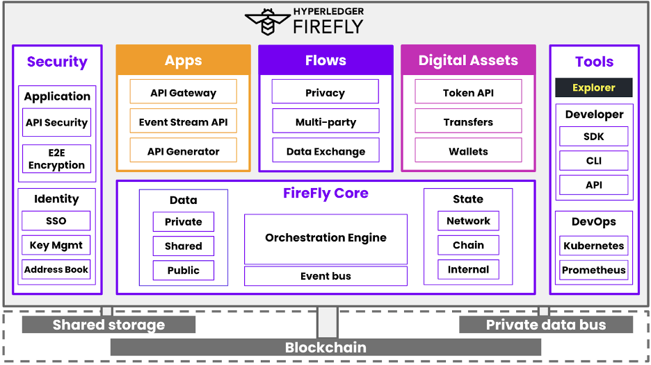

# 2022 Q2 Hyperledger FireFly

Created by Ray Chen, last modified by Jim Zhang on Aug 25, 2022

# Project Health

We achieved a significant milestone this quarter with the release of
Hyperledger FireFly 1.0.  In case you missed it, check out the <a href="https://www.hyperledger.org/hyperledger-firefly/2022/04/13/introducing-hyperledger-firefly-1-0-the-supernode-for-enterprise-web3-applications" class="external-link" rel="nofollow">launch blog </a> . 
Here is a quick recap of the 1.0 stack from the launch webinar:

The FireFly SuperNode: a complete stack for enterprises to build and
scale secure Web3 applications. 

The 1.0 release includes a rich set
of functionality that is hardened for production use and represents a
major step in the development of the complete FireFly stack:

- **FireFly Core -** Support for multiple protocols across public and
private chains with a powerful orchestration engine backed by a
scalable event bus. Manage private data, on-chain data, and shared
storage. Track state across networks, chains, and internal back
office systems.
- **Apps** - Accelerate development with tools that make building on
Web3 familiar to any Web2 developer, including an API Gateway, Event
Streams, and the Smart Contract API Generator.
- **Flows** - Coordinate how data, value, and processes flow both
on-chain and off-chain in decentralized networks, while maintaining
privacy and security.
- **Digital Assets** - Manage tokens at institutional scale with APIs
that simplify the creation, transfer, and tracking of fungible and
non-fungible tokens. Simplify custody with robust wallet and key
management integration capabilities. 
- **Tools** - Monitor transactions, messages, and events in the
FireFly Explorer. Test out key FireFly functionality and generate
example code snippets in the FireFly Sandbox. Run apps with a rich
set of DevOps tools on modern, scalable cloud architecture.

We hosted 2 webinars and 3 meetups on Hyperledger FireFly that had over
1,000 registrants and generated over 14,500 views on their recordings.  

We've also seen an uptick in new community members this quarter
participating in discussions in Discord with 71 people versus 23 the
previous quarter.

Contributors are very active in the project and in the month of May,
excluding merges, we’ve had 8 authors push 144 commits to main.

There are currently 370K lines of code for Hyperledger FireFly across 11
repositories, with a total of 4.6K commits to date.

# Required Information

1.  <a href="https://wiki.hyperledger.org/display/TSC/Projects+have+two+quarters+to+comply+with+common+repo+structure?focusedCommentId=41591637#comment-41591637" rel="nofollow">Have you switched from master to main in all your
repos</a>  ? Yes 
2.  
<a href="https://tsc.hyperledger.org/repository-structure.html" class="external-link" rel="nofollow">Have you implemented the Common
Repository Structure in all your repos</a>   ? Yes 
3.  Has your project implemented these
inclusive language changes listed below to your repo? You can
optionally
<a href="https://github.com/petermetz/gh-action-dci-lint#usage" class="external-link" rel="nofollow">use the DCI Lint tool</a> to
make this a recurring action on your repo. Yes  
1. master → main
2. slave → replicas
3. blacklist → denylist
4. whitelist → allowlist
4.  Have you added an <a href="https://wiki.hyperledger.org/display/TSC/Inclusive+Language+Example" rel="nofollow">Inclusive Language Statement</a> to your project's
documentation and/or Wiki pages? No 

# Questions/Issues for the TSC

No questions for the TSC

# Releases

April:

<a href="https://github.com/hyperledger/firefly/releases/tag/v1.0.0" class="external-link" rel="nofollow">FireFly 1.0 </a>

May:

<a href="https://github.com/hyperledger/firefly/releases/tag/v1.0.1" class="external-link" rel="nofollow">FireFly 1. </a>
<a href="https://github.com/hyperledger/firefly/releases/tag/v1.0.1" class="external-link" rel="nofollow">0.1</a>

<a href="https://github.com/hyperledger/firefly/releases/tag/v1.0.2" class="external-link" rel="nofollow">FireFly 1. </a>
<a href="https://github.com/hyperledger/firefly/releases/tag/v1.0.2" class="external-link" rel="nofollow">0.2</a>

The full list of releases can be found at:
<a href="https://github.com/hyperledger/firefly/releases" class="external-link" rel="nofollow">https://github.com/hyperledger/firefly/releases</a>

# Overall Activity in the Past Quarter

The Discord is very active and project maintainers answer questions
regularly. Some metrics for the last 90 days of activity.

<table class="wrapped confluenceTable">
<tbody>
<tr class="odd">
<td class="confluenceTd">
<strong>Dimension</strong>
</td>
<td class="confluenceTd">
<strong>Link to Insights</strong>
</td>
</tr>
<tr class="even">
<td class="confluenceTd">
PR Activities 
</td>
<td class="confluenceTd">
<a href="https://insights.lfx.linuxfoundation.org/projects/hyperledger%2Ffirefly/dashboard;subTab=technical;v=pull-request-management%2Fgithub-pr%2Foverview" class="external-link" rel="nofollow">https://insights.lfx.linuxfoundation.org/projects/hyperledger%2Ffirefly/dashboard;subTab=technical;v=pull-request-management%2Fgithub-pr%2Foverview</a>
</td>
</tr>
<tr class="odd">
<td class="confluenceTd">
Contributor Strength 
</td>
<td class="confluenceTd">
<a href="https://insights.lfx.linuxfoundation.org/projects/hyperledger%2Ffirefly/dashboard;quicktime=time_filter_3M" class="external-link" rel="nofollow">https://insights.lfx.linuxfoundation.org/projects/hyperledger%2Ffirefly/dashboard;quicktime=time_filter_3M</a>
</td>
</tr>
<tr class="even">
<td class="confluenceTd">
Commit Activities 
</td>
<td class="confluenceTd">
<a href="https://insights.lfx.linuxfoundation.org/projects/hyperledger%2Ffirefly/dashboard;subTab=technical;v=source-control%2Fcommits%2Foverview" class="external-link" rel="nofollow">https://insights.lfx.linuxfoundation.org/projects/hyperledger%2Ffirefly/dashboard;subTab=technical;v=source-control%2Fcommits%2Foverview</a>
</td>
</tr>
</tbody>
</table>

# Current Plans

- Active: Enhanced connector framework structure 

- - active development on new public chain connectors for Ethereum
and Bitcoin

<!-- -->

- Active: Namespace isolation

- - Allows single FireFly SuperNode to talk to multiple blockchains 
- Major step towards multi-tenancy support

- Active: New operation modes for Gateway and Consortium 

- - Explicit multi-chain support

- Active: Revamped docs site

- - Major updates throughout for v1.0
- Top level version toggle
- Multi-language support starting with Chinese
- Automated API and object reference sections

- Queued: Enhanced API Security model

Please see the GitHub project board for our most updated plans:
<a href="https://github.com/orgs/hyperledger/projects/4/views/7" class="external-link" rel="nofollow">https://github.com/orgs/hyperledger/projects/4/views/7</a>

# Maintainer Diversity

No new maintainers in this quarter.

# Contributor Diversity

Contributions in Q2 including code, documentation, or other
contributions:

Active contributors from Kaleido: 10

Active contributors from other organizations: 1 (Built Technologies)

# Additional Information

Various enterprises are already using FireFly for their business
products and live deployments. 

These include the following:

**Riskstream** - The largest enterprise-level blockchain consortium in
risk management and insurance uses Hyperledger FireFly for First Notice
of Loss (FNOL) data sharing between companies, Mortality Monitor which
offers a single source of digital decedent information required to
process life insurance claims, Surety Bond Verification for Power of
Attorney, and Licensing and Appointments micro credentialing.

**Synaptic Health Alliance** - A coalition of US healthcare leaders
leveraged Hyperledger FireFly to create a blockchain-based decentralized
Provider Data Directory. This directory tackles the challenge of
providing access to care via accurate provider data.

**TradeGo** - A global commodity trading consortium that uses
Hyperledger FireFly to get its Digital Presentation product to
production much quicker and lower cost than initially expected. Digital
Presentation enables highly efficient and transparent sharing of
original, confidential trade documents in a digital format. 

**AscendBit** - AscendBit is a company owned by CP Group that is using
Hyperledger FireFly to launch initiatives in Supply Chain as well as its
own company coin.

The leaders of the Riskstream and Synaptic consortiums spoke at our
FireFly <a href="https://www.youtube.com/watch?v=j3IXHE-vyNI" class="external-link" rel="nofollow">launch </a> and the
CEO of TradeGo and CTO of AscendBit recently spoke at our FireFly 1.0 AP
<a href="https://www.youtube.com/watch?v=Yw6SRWCULMg&amp;t=325s" class="external-link" rel="nofollow">webinar </a> .

Technical metrics from March 15, 2022 to June 15, 2022 may be found
<a href="https://tinyurl.com/25v49uzt" class="external-link" rel="nofollow">here </a>

# Reviewed By

- ✅ 
<a href="https://wiki.hyperledger.org/display/~angelo.decaro" class="confluence-userlink user-mention" data-username="angelo.decaro" data-linked-resource-id="16327529" data-linked-resource-version="1" data-linked-resource-type="userinfo" data-base-url="https://wiki.hyperledger.org">Angelo De Caro</a>
- ✅ 
<a href="https://wiki.hyperledger.org/display/~lehors" class="confluence-userlink user-mention" data-username="lehors" data-linked-resource-id="2394240" data-linked-resource-version="1" data-linked-resource-type="userinfo" data-base-url="https://wiki.hyperledger.org">Arnaud J Le Hors</a>
- ✅ 
<a href="https://wiki.hyperledger.org/display/~C0rWin" class="confluence-userlink user-mention" data-username="C0rWin" data-linked-resource-id="13865321" data-linked-resource-version="1" data-linked-resource-type="userinfo" data-base-url="https://wiki.hyperledger.org">Artem Barger</a>
- 🔲 
<a href="https://wiki.hyperledger.org/display/~arsulegai" class="confluence-userlink user-mention" data-username="arsulegai" data-linked-resource-id="6427759" data-linked-resource-version="2" data-linked-resource-type="userinfo" data-base-url="https://wiki.hyperledger.org">Arun S M</a> 
- ✅ 
<a href="https://wiki.hyperledger.org/display/~Bobbijn" class="confluence-userlink user-mention" data-username="Bobbijn" data-linked-resource-id="2393198" data-linked-resource-version="2" data-linked-resource-type="userinfo" data-base-url="https://wiki.hyperledger.org">Bobbi Muscara</a>
- ✅ 
<a href="https://wiki.hyperledger.org/display/~shemnon" class="confluence-userlink user-mention" data-username="shemnon" data-linked-resource-id="20022118" data-linked-resource-version="2" data-linked-resource-type="userinfo" data-base-url="https://wiki.hyperledger.org">Danno Ferrin</a>  
- ✅ 
<a href="https://wiki.hyperledger.org/display/~denyeart" class="confluence-userlink user-mention" data-username="denyeart" data-linked-resource-id="2392864" data-linked-resource-version="1" data-linked-resource-type="userinfo" data-base-url="https://wiki.hyperledger.org">David Enyeart</a>
- 🔲 
<a href="https://wiki.hyperledger.org/display/~grace.hartley" class="confluence-userlink user-mention" data-username="grace.hartley" data-linked-resource-id="16324128" data-linked-resource-version="1" data-linked-resource-type="userinfo" data-base-url="https://wiki.hyperledger.org">Grace Hartley</a>
- ✅ 
<a href="https://wiki.hyperledger.org/display/~jimthematrix" class="confluence-userlink user-mention" data-username="jimthematrix" data-linked-resource-id="58854075" data-linked-resource-version="1" data-linked-resource-type="userinfo" data-base-url="https://wiki.hyperledger.org">Jim Zhang</a> 
- ✅ 
<a href="https://wiki.hyperledger.org/display/~knagware9" class="confluence-userlink user-mention" data-username="knagware9" data-linked-resource-id="2393468" data-linked-resource-version="1" data-linked-resource-type="userinfo" data-base-url="https://wiki.hyperledger.org">Kamlesh Nagware</a>
- ✅ 
<a href="https://wiki.hyperledger.org/display/~nage" class="confluence-userlink user-mention" data-username="nage" data-linked-resource-id="2393038" data-linked-resource-version="1" data-linked-resource-type="userinfo" data-base-url="https://wiki.hyperledger.org">Nathan George</a>
- ✅ 
<a href="https://wiki.hyperledger.org/display/~gl7doqu97svck56tzyjzzhxj" class="confluence-userlink user-mention" data-username="gl7doqu97svck56tzyjzzhxj" data-linked-resource-id="24779271" data-linked-resource-version="1" data-linked-resource-type="userinfo" data-base-url="https://wiki.hyperledger.org">Peter Somogyvari</a>
- ✅ 
<a href="https://wiki.hyperledger.org/display/~tkuhrt" class="confluence-userlink user-mention" data-username="tkuhrt" data-linked-resource-id="1180151" data-linked-resource-version="2" data-linked-resource-type="userinfo" data-base-url="https://wiki.hyperledger.org">Tracy Kuhrt</a> 
- ✅ 
<a href="https://wiki.hyperledger.org/display/~troyronda" class="confluence-userlink user-mention" data-username="troyronda" data-linked-resource-id="9110618" data-linked-resource-version="2" data-linked-resource-type="userinfo" data-base-url="https://wiki.hyperledger.org">Troy Ronda</a> 

# Submission date 

 08-Jun-2022 

## Comments:

<table data-border="0" width="100%">
<colgroup>
<col style="width: 100%" />
</colgroup>
<tbody>
<tr class="odd">
<td>
<blockquote>

 Have you added an  <a href="https://wiki.hyperledger.org/display/TSC/Inclusive+Language+Example" rel="nofollow" style="text-decoration: none;">Inclusive Language
Statement</a>  to your project's documentation and/or Wiki pages? No 

</blockquote>

Do you have
a plan for when you will do this? 

 Posted by tkuhrt at Jun
09, 2022 15:55 
</td>
</tr>
<tr class="even">
<td style="border-top: 1px dashed #666666">

The last time I had heard anything about the Inclusive Language
Proposal, it was still early in the proposal state. I read the Wiki
pages and see that it has now been finalized so we'll go ahead and get
this added. I'll take care of this next week.

Posted by nguyer at Jun
16, 2022 13:35 
</td>
</tr>
</tbody>
</table>

