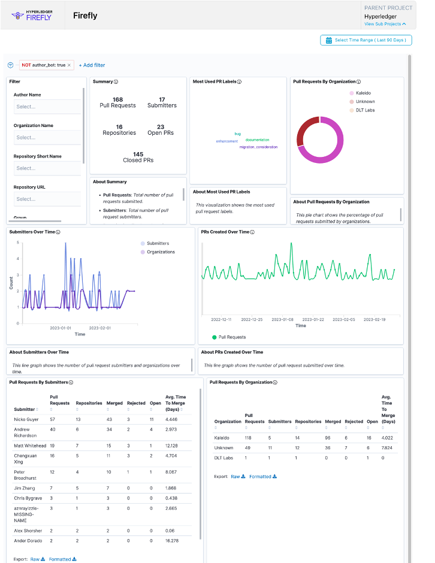
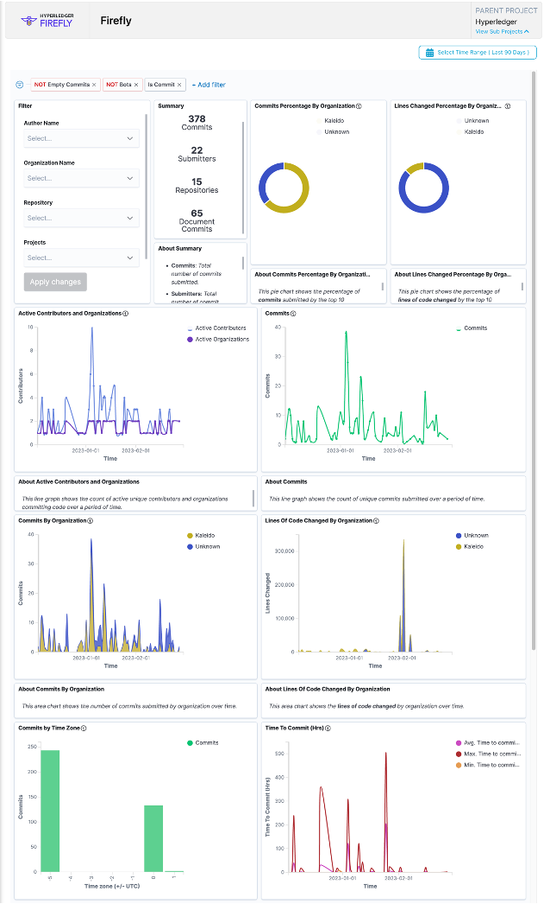

# Project Health

FireFly V1.2 was released this quarter with an announcement with greater detail [here](https://www.hyperledger.org/blog/2023/02/13/hyperledger-firefly-v1-2-is-now-available). Highlights include token API enhancements, experience enhancements, and updated blockchain connector settings.

The Discord community continues to be very active with 74 members participating in discussions this quarter. Additionally, we’ve seen an increase in non-maintainer engagement, with community members conversing and answering each other’s questions.

Contributors are very active in the project and since December, excluding merges, we’ve had 22 authors push 378 commits to main.

There are currently 640k lines of code for Hyperledger FireFly across 19 repositories, with a total of 7k commits to date.

# Required Information

- Have you switched from master to main in all your repos? Yes
- Have you implemented the [Common Repository Structure](../../governing-documents/repository-structure.md) in all your repos? Yes
- Has your project implemented these inclusive language changes listed below to your repo? You can optionally [use the DCI Lint tool](https://github.com/petermetz/gh-action-dci-lint#usage) to make this a recurring action on your repo. Yes
  - master → main
  - slave → replicas
  - blacklist → denylist
  - whitelist → allowlist
- Have you added an [Inclusive Language Statement](https://wiki.hyperledger.org/display/TSC/Inclusive+Language+Example) to your project's documentation and/or Wiki pages? Yes

# Questions/Issues for the TSC

No questions for the TSC

# Releases

January:

[FireFly 1.1.3](https://github.com/hyperledger/firefly/releases/tag/v1.1.3)

February:

[FireFly 1.2](https://github.com/hyperledger/firefly/releases/tag/v1.2.0)

The full list of releases can be found at: https://github.com/hyperledger/firefly/releases

# Overall Activity in the Past Quarter

The Discord is very active and project maintainers answer questions regularly. Some metrics for the last 90 days of activity.

PR Activities:

https://insights.lfx.linuxfoundation.org/projects/hyperledger%2Ffirefly/dashboard;subTab=technical;v=pull-request-management%2Fgithub-pr%2Foverview

Contributor Strength:

https://insights.lfx.linuxfoundation.org/projects/hyperledger%2Ffirefly/dashboard;quicktime=time_filter_3M

Commit Activities:

https://insights.lfx.linuxfoundation.org/projects/hyperledger%2Ffirefly/dashboard;subTab=technical;v=source-control%2Fcommits%2Foverview

# Current Plans

Current areas of active engineering, investigation or interest include:

- Associating FireFly messages with custom contract transactions
- Addition of support for postgres persistence for blockchain connector toolkit
- Rearchitecture of policy engine design

# Maintainer Diversity

No new maintainers in this quarter. 10/10 maintainers are from Kaleido. https://github.com/orgs/hyperledger/teams/firefly-committers/members

# Contributor Diversity

Contributions in Q4 including code, documentation, or other contributions:

Active contributors from Kaleido: 14

Active contributors from other organizations: 8
