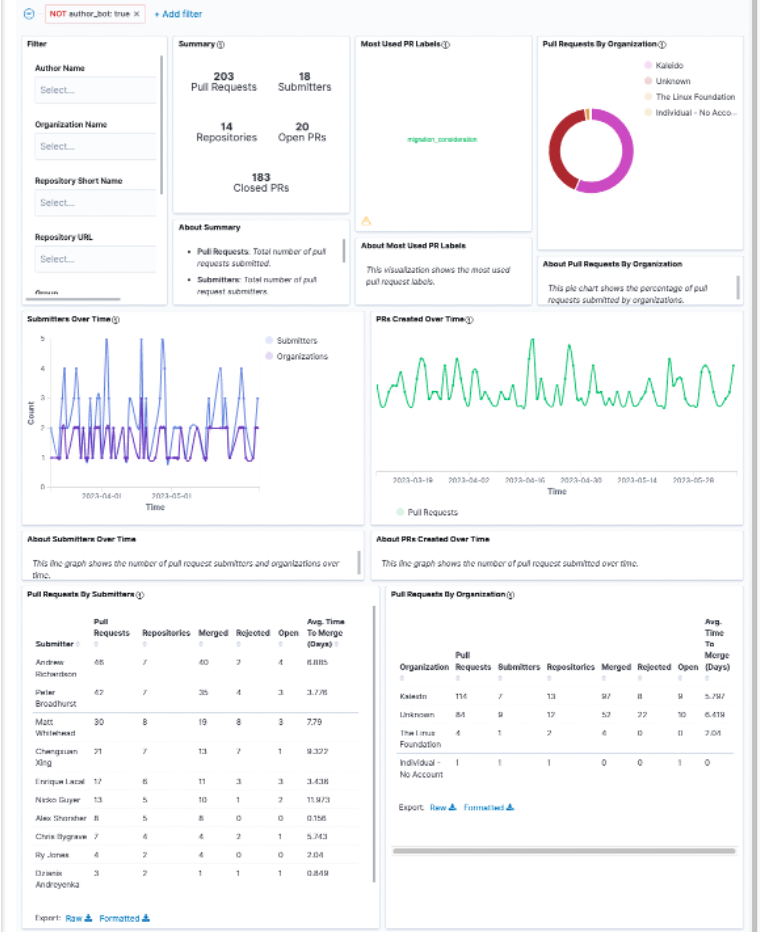
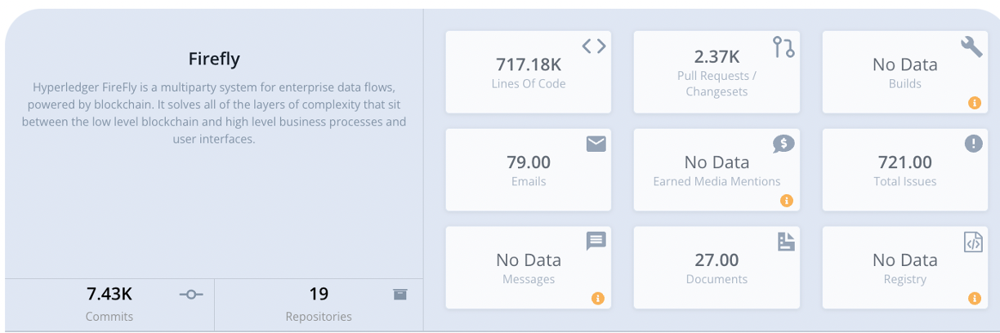
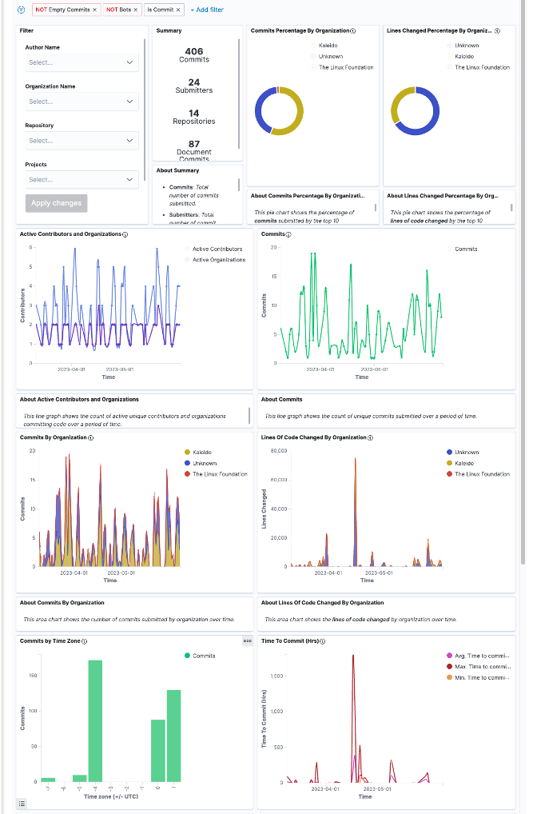
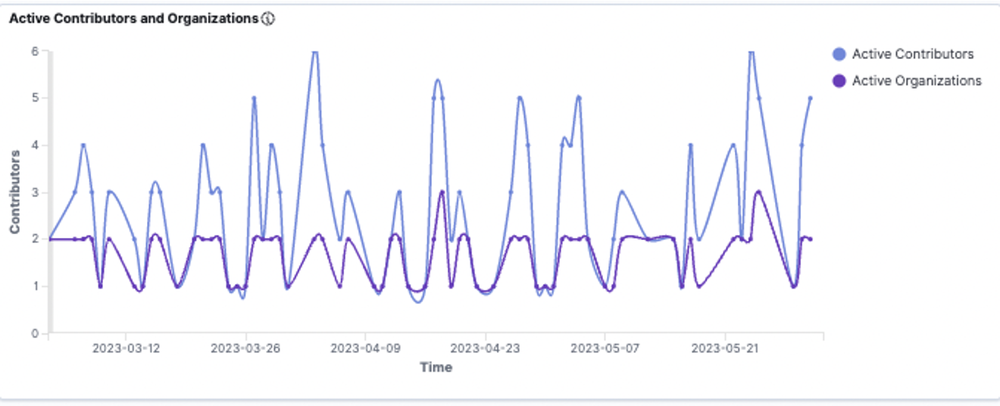
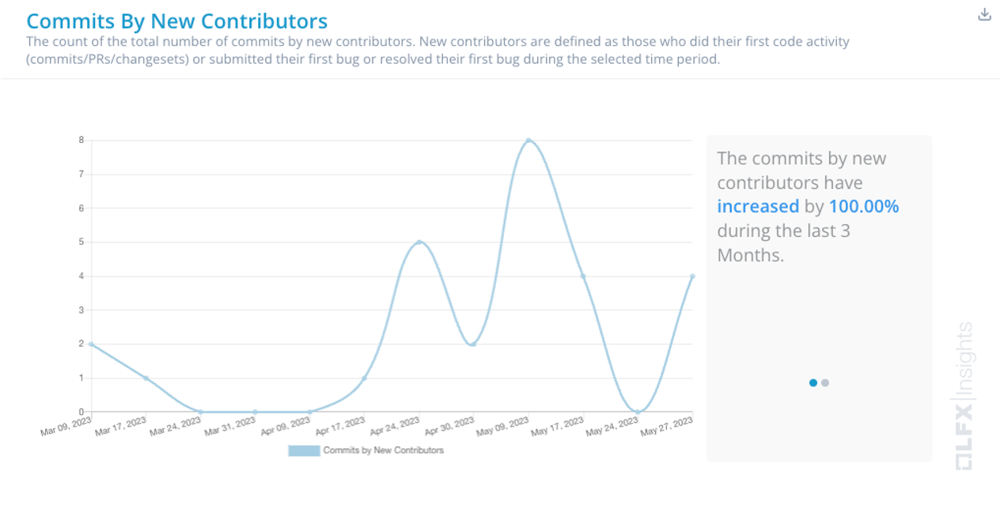
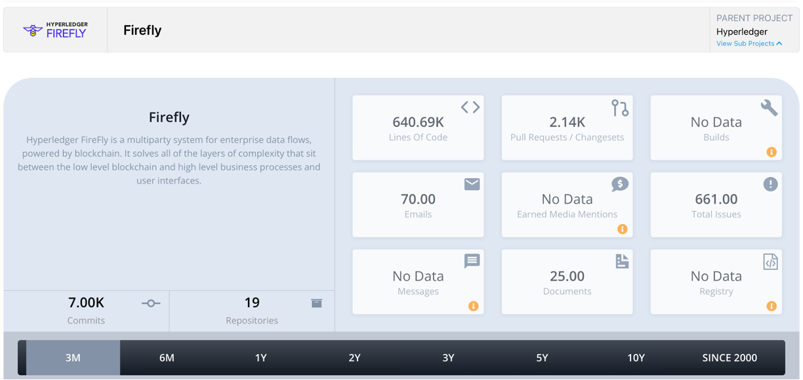
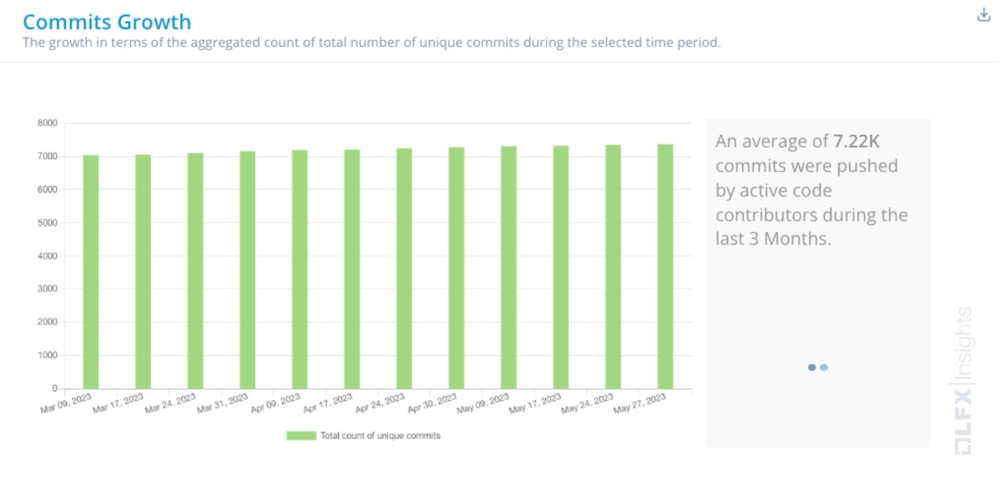
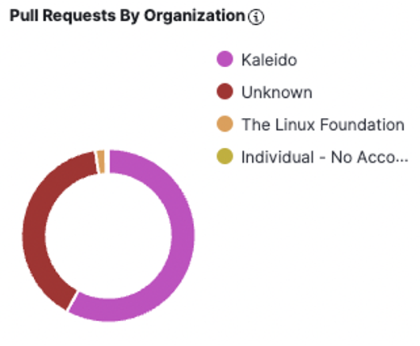

# Project Health

Hyperledger FireFly has seen very strong activity over the past year and this has continued to gain even more momentum this quarter. It has powered many use cases in the community,  with examples that include SWIFT, CGI Federal, and LACChain.

### Community adoption updates

- Swift completed successful testing of cross-border CBDC payments on a [CBDC sandbox leveraging Hyperledger FireFly](https://www.swift.com/news-events/news/successful-testing-paves-way-cbdc-use-cross-border) with 18 central and commercial banks, including the Banque de France, the Deutsche Bundesbank, the Monetary Authority of Singapore, BNP Paribas, HSBC, Intesa Sanpaolo, NatWest, the Royal Bank of Canada, SMBC, Société Générale, Standard Chartered, and UBS.

- [CGI Federal](https://www.youtube.com/watch?v=jLoOW0g5WdE) spoke about digital transformation in government at Consensus 2023 and how FireFly has helped them break down data silos and enable collaboration in real-time for government agencies. Example projects include bringing auditability to the Department of Defense supply chain, tokenization of the space economy, securing metaverse assets, sharing healthcare data with zero trust, and enabling transparency and accountability in AI.

- LACChain is a blockchain infrastructure project designed for enabling inclusive and scalable projects and solutions on web 3.0 for Latin American and the Caribbean. FireFly is a key component of their tech stack and they have written up a [tutorial](https://lacnet.lacchain.net/firefly/) for deploying FireFly onto LACChain.

### Community members have given talks featuring Hyperledger FireFly at a number of events including

- Hyperledger Meetup: [The future of Web3](https://www.youtube.com/watch?v=gvUQmPXHS0Y), featuring speakers from Fidelity, IBM, and Duke University.

- Hyperledger Workshop: [Using Hyperledger FireFly to Launch an NFT Collection on Public Chains](https://www.youtube.com/watch?v=OMI-xuysiwI)

- Consensus 2023: [The CBDC Tech Stack: How One Ethereum Firm is Working with Central Banks](https://consensus.coindesk.com/agenda/event/-how-to-make-cross-chain-bridges-hack-proof-8)

- BuildEth: Build Ethereum dApps Quicker than Ever with Hyperledger FireFly

- Blockchain Expo: From Web2 to Web3: How Enterprises are Adopting Blockchain, Digital Assets and NFTs

### Contributor activity updates

The Discord community continues to be very active with 86 members participating in discussions this quarter. Additionally, we’ve seen an increase in non-maintainer engagement, with community members conversing and answering each other’s questions.

In the community, builders have been working on various extensions for FireFly for public blockchain communities such as Tezos.
Contributors are active in the project and since March, commits by new contributors have increased by 100%.
There are currently 715k lines of code for Hyperledger FireFly across 19 repositories, with a total of 7.4k commits to date.

FireFly has had significant performance and experience updates allowing for much more flexible configurations with the release of FireFly 1.2. Details may be found in the “Releases” section that follows below.

# Required Information

- Have you switched from master to main in all your repos? Yes
- Have you implemented the [Common Repository Structure](../guidelines/repository-structure.md) in all your repos? Yes
- Has your project implemented these inclusive language changes listed below to your repo? You can optionally [use the DCI Lint tool](https://github.com/petermetz/gh-action-dci-lint#usage) to make this a recurring action on your repo. Yes
  - master → main
  - slave → replicas
  - blacklist → denylist
  - whitelist → allowlist
- Have you added an [Inclusive Language Statement](https://wiki.hyperledger.org/display/TSC/Inclusive+Language+Example) to your project's documentation and/or Wiki pages? Yes

# Questions/Issues for the TSC

No questions for the TSC

# Releases

Key releases include:

[FireFly 1.2](https://github.com/hyperledger/firefly/releases/tag/v1.2.0) which includes performance upgrades, significant experience updates, and much more flexible configurations. Highlights of this new release include:

__OpenZepplin Wizard Support__: FireFly's token APIs now work with a much wider variety of ERC-20, ERC-721, and ERC-1155 contracts, supporting variations of these contracts generated by the [OpenZepplin Contract Wizard](https://docs.openzeppelin.com/contracts/4.x/wizard).

__Operational Improvements__: Request ID tracking through FireFly microservices, along with support for passing custom HTTP headers allow increased traceability and better operational efficiency. Additionally, richer error reporting now supports custom smart contract error messages passed all the way back to FireFly’s API, making troubleshooting easier.

__Error Feedback__: Custom smart contract error types are now returned on the API.

__Data & Blob Deletion__: Data objects and blob rows may be removed from the FireFly database and Data Exchange microservice.

__Dynamic Reload of Core Config File__: You can now edit the configuration file and have FireFly automatically reload it, without having to restart the whole service.

__Evmconnect Support__: Evmconnect is now the default blockchain connector for Ethereum based FireFly stacks. Differences compared with Ethconnect include:
    - Policy Management Engine: Engine for gas cost estimation and automatic transaction resubmission
    - Signing and Nonce Management: Compatibility with public blockchains

[FireFly 1.1.4](https://github.com/hyperledger/firefly/releases/tag/v1.1.4) which includes minor performance updates and bug fixes. This demonstrates our commitment to support users that need bug fixes but have not yet moved to a new minor release. Updates include:

- Replacing “UpsertBatch” with “InsertOrGetBatch”
- Re-poll immediately on full batch
- Inclusion of signing key in batch processor identifier

The full list of releases can be found at: [https://github.com/hyperledger/firefly/releases](https://github.com/hyperledger/firefly/releases)

# Overall Activity in the Past Quarter

The Discord is very active and project maintainers answer questions regularly. Some metrics for the last 90 days of activity.

PR Activities:

<https://insights.lfx.linuxfoundation.org/projects/hyperledger%2Ffirefly/dashboard;subTab=technical;v=pull-request-management%2Fgithub-pr%2Foverview>

Contributor Strength:

<https://insights.lfx.linuxfoundation.org/projects/hyperledger%2Ffirefly/dashboard;quicktime=time_filter_3M>

Commit Activities:

<https://insights.lfx.linuxfoundation.org/projects/hyperledger%2Ffirefly/dashboard;subTab=technical;v=source-control%2Fcommits%2Foverview>

# Current Plans

CCurrent plans include feature enhancements and bug fixes.

The top roadmap item active-active HA for FF core. This will offer scaling improvements, increased resiliency, and more flexible deployment and migration options. This work is currently in the design phase and the related work is being tracked in GitHub.

# Maintainer Diversity

No new maintainers in this quarter.

# Contributor Diversity

In the past quarter we’ve seen an increase in contributor strength, commit growth, and new contributors from parties outside of Kaleido.

