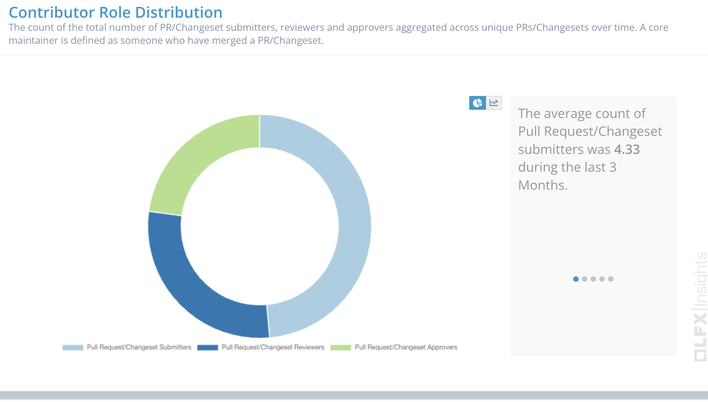

# Project Health

Hyperledger FireFly is applying to move to Graduated Project status. A separate document will be submitted to the TOC to propose this change. Throughout the past year, there has been very strong activity within the project, and Hyperledger FireFly has continued to gain even more momentum this quarter. FireFly is powering many use cases in the blockchain and digital assets community, with recent examples that include Swift’s phase 2 CBDC work with 32 central and global transaction banks across 4 use cases, and the DFCRC and Reserve Bank of Australia CBDC work running 15 projects including ones with ANZ Bank and Mastercard.

Hyperledger published the case study [The Hyperledger FireFly Story: Kaleido Taps into the Hyperledger Community to Develop Next-Gen Solutions](https://media.licdn.com/dms/document/media/D561FAQFHEjkdNUvJEg/feedshare-document-pdf-analyzed/0/1692713935821?e=1694044800&v=beta&t=KLpydg2_L7VbFMuSJpm3OsnKUJbxw3Q6dDzto_UPFGE).

We have onboarded 3 new maintainers to the project and one maintainer has transitioned to a new company. These new maintainers include Matthew Whitehead & Chengxuan Xing from Kaleido and Dzianis Andreyenka from OneOf/Instinctools. Vinod Damle has moved to Fidelity Investments and will continue as a maintainer.

The Hyperledger FireFly team has been working closely with developers at OneOf over the past year as they built a new FireFly blockchain connector for the Tezos blockchain. They also demoed this new blockchain connector at a recent FireFly Community Call. This codebase is in the process of being open sourced and donated to the Hyperledger FireFly project.

Community adoption updates:

- The DFCRC and Reserve Bank of Australia released the [results of their CBDC Pilot](https://www.rba.gov.au/payments-and-infrastructure/central-bank-digital-currency/pdf/australian-cbdc-pilot-for-digital-finance-innovation-project-report.pdf) which leveraged Hyperledger FireFly. Some use cases tested in the pilot include:
  - A wholesale car dealer generated a tokenized invoice representing a claim on a wholesale buyer.
  - Offline customer-to-merchant transactions using NFC-enabled smart cards and pilot CBDC between RMIT University and Southern Cross University
  - Two banks trading tokenized debt securities in wholesale markets

Community members have given talks featuring Hyperledger FireFly at a number of events including:

- Consensus 2023: [The CBDC Tech Stack: How One Ethereum Firm is Working with Central Banks](https://www.youtube.com/watch?v=L1MeqCRfQDw&ab_channel=Kaleido)
- Hyperledger Workshop: [Hyperledger FireFly and DIDs](https://www.youtube.com/watch?v=ICp6AX9zsW8&ab_channel=HyperledgerFoundation)
- Webinar: [Launch Enterprise Scale NFT Experiences That Customer Love](https://www.youtube.com/watch?v=YrrSp2SKcfQ&ab_channel=Kaleido)
- EthCC: [State of Enterprise Blockchain](https://www.youtube.com/watch?v=1XruoWm9cF4)
- Point Zero Forum: [SME Financing via Programmable Money and Tokenization hosted by Bank of Thailand](https://www.pointzeroforum.com/insights/sme%20financing%20via%20programmable%20money%20and%20tokenisation?hsLang=en)

Contributor activity updates:

The star activity for the FireFly repository has continued to grow from 339 end of last quarter to 398 end of this quarter. Discord activity remains consistent with ~45 DAU.

Contributors are active in the project and since June there were 14 new contributors who performed at least one commit.

There are currently 748k lines of code for Hyperledger FireFly across 19 repositories, with a total of 7.7k commits to date.

# Questions/Issues for the TOC

Given the maturity of the project, and the recent changes in maintainership, FireFly meets the required and recommended criteria for Incubation Exit and will be submitting a separate proposal to the TOC to become a Graduated Project.

# Releases

## [FireFly v1.2.2](https://github.com/hyperledger/firefly/releases/tag/v1.2.2)

FireFly v1.2.2 is a patch that fixes several issues, including:

- FabConnect not being able to set transactionindex and eventindex
- Correctly parse blockchain subscription names when delivering events

## [FireFly v1.2.1](https://github.com/hyperledger/firefly/releases/tag/v1.2.1)

FireFly v1.2.1 is a patch release that contains many fixes, including:

- Fixed postgres optimizations, fail gracefully when inserting many data rows
- Replace “UpsertBatch” with “InsertOrGetBatch”
- Enable workflows for release branch
- Backport fixes
- Fixed multiple named tuple result from contract

# Overall Activity in the Past Quarter

The major highlights have been detailed at the beginning of the report. In summary, there has been a lot of activity in the project. New community members continue to discover the project and make contributions. This quarter has seen the most significant new contribution from outside the set of the original maintainers, in the form of an entirely new blockchain connector.

# Current Plans

## FireFly v1.3.0

The next feature release of FireFly is currently in active development and is expected to be available in early Q4 2023. It will include many new exciting features:

- Significantly enhanced onchain / offchain data coordination including the ability to attach a FireFly message to a custom contract invocation
- Additional APIs for deleting FireFly Resources such as Token Pools, Contract Interfaces etc.
- Configurable mTLS security across FireFly microservices for internal service-to-service authentication and encryption
- PostgreSQL support for EVMConnect persistence
- ERC-1155 token connector improvements for supporting a wider variety of ERC-1155 contracts
- Performance improvements in transaction throughput and latency

An additional, significant architectural roadmap item is active-active HA for FF FireFly Core. This will offer scaling improvements, increased resiliency, and more flexible deployment and migration options. This work is currently in the design phase and the related work is being tracked in GitHub.

# Maintainer Diversity

FireFly now has 12 maintainers representing three different companies:

- [Kaleido](https://kaleido.io/)
- [Fidelity](https://www.fidelity.com/)
- [OneOf](https://www.oneof.com/)

It is worth noting that each company has at least one maintainer who is a subject matter expert on one or more specific blockchain connectors, and the most foundational parts of the FireFly technology stack.

A list of all maintainers for Hyperledger FireFly may be found [here](https://wiki.hyperledger.org/display/FIR/Maintainers). Several changes in maintainers have occurred this quarter:

| Name               | Company              | Status         |
| ------------------ | -------------------- | -------------- |
| Matthew Whitehead  | Kaleido              | New Maintainer |
| Chengxuan Xing     | Kaleido              | New Maintainer |
| Dzianis Andreyenka | OneOf/Instinctools   | New Maintainer |
| Vinod Damle        | Fidelity Investments | New company    |

# Contributor Diversity

In the past quarter we’ve seen an increase in contributor strength, commit growth, and new contributors from parties outside of Kaleido.

# Additional Information

No additional information
