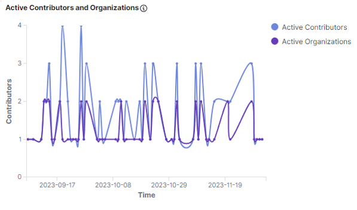
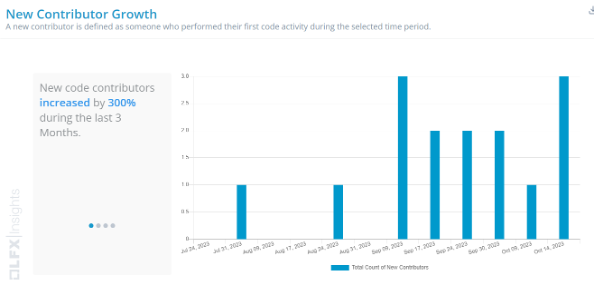
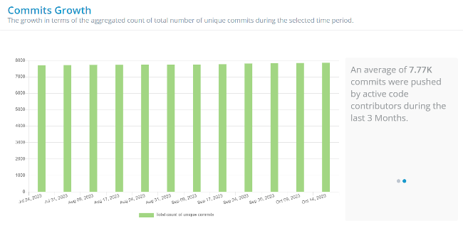
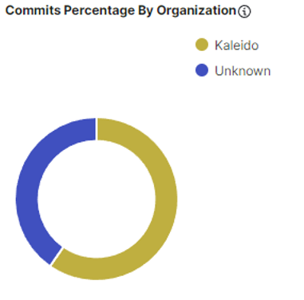
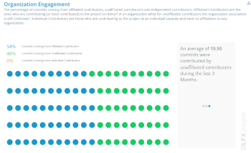

# Project Health

Hyperledger FireFly has successfully achieved [Graduated Project status](https://www.hyperledger.org/blog/hyperledger-firefly-achieves-graduated-status-is-in-production-around-the-world). Over the past 2.5 years, FireFly has become one of the fastest growing projects in the Web3 space with almost a million lines of code. Hyperledger FireFly is used in production around the world in a variety of use cases including Synaptic Health Alliance, The Institutes RiskStream Collaborative, Swift, CGI Federal, Blockchain for Energy, CP Group, and LACChain. Additionally, Hyperledger FireFly powers many use cases in the digital assets community, with recent examples that include Swift’s phase 2 CBDC work with over 35 central and global transaction banks across 4 use cases, and the DFCRC and Reserve Bank of Australia CBDC work running 15 projects including ones with ANZ Bank and Mastercard.

### Community adoption updates

- [Warner Music Group](https://www.wmgrewards.com/)
  - Warner Music Group rewards is powered by FireFly and Tezos and is live in production
  - Tokens for sweepstakes are earned by users who link their Spotify account and follow bands and favorite songs
- Blockchain for Energy Commodity Transport
  - Blockchain for Energy is a consortium with members including Chevron, ExxonMobil, Respol, Worley, Pioneer, Schlumberger, and more.
  - The Commodity Transport use case digitizes the current manual validation processes for commodity deliveries and logistics and utilizes FireFly to link together on and off-chain systems.
  - The application creates real-time visibility and hyper-automation for field logistics, ensuring significant cost reductions, streamlined operations, and frictionless consumer-supplier interactions.

Community members have given talks featuring Hyperledger FireFly at a number of events including:

- Hyperledger Webinar: [Driving Digital Transformation in Government with Hyperledger FireFly](https://www.youtube.com/watch?v=M0kfnZzk8jU)
- Hyperledger Meetup: [Creating and Open Sourcing a Tezos Connector for Hyperledger FireFly](https://www.youtube.com/watch?v=5Y2Wnld0aJg)
- Sibos 2023: [Managing Digital Assets at Scale: Lessons Learned and What’s Next](https://www.kaleido.io/resources/managing-digital-assets-at-scale-lessons-learned-and-whats-next)
- Kaleido & AWS event: [Unlocking the Potential of Asset Tokenization](https://www.kaleido.io/nyc-tokenization-event)
- All Things Open: [An Introduction to Open Source Tools for Building in Web3](https://2023.allthingsopen.org/sessions/an-introduction-to-open-source-tools-for-building-in-web3/)
- Hyperledger Member Webinar: [The Emerging Tech Stack for Digital Assets and Asset Tokenization](https://www.youtube.com/watch?v=heVWZZnz-j4)

### Contributor activity updates

The star activity for the FireFly repository has continued to grow from 390 end of last quarter to 430 end of this quarter. Discord activity remains consistent with ~45 DAU.

There are currently 767k lines of code for Hyperledger FireFly across 19 repositories, with a total of 8.0k commits to date.

# Questions/Issues for the TOC

None

# Releases

## [FireFly v1.2.2](https://github.com/hyperledger/firefly/releases/tag/v1.2.2)

FireFly v1.2.2 is a patch that fixes several issues, including:

- FabConnect not being able to set transactionindex and eventindex
- Correctly parse blockchain subscription names when delivering events

## [FireFly v1.2.1](https://github.com/hyperledger/firefly/releases/tag/v1.2.1)

FireFly v1.2.1 is a patch release that contains many fixes, including:

- Fixed postgres optimizations, fail gracefully when inserting many data rows
- Replace “UpsertBatch” with “InsertOrGetBatch”
- Enable workflows for release branch
- Backport fixes
- Fixed multiple named tuple result from contract

# Overall Activity in the Past Quarter

The major highlights have been detailed at the beginning of the report. In summary, there has been a lot of activity in the project. New community members continue to discover the project and make contributions.

# Current Plans

## FireFly v1.3.0

The next feature release of FireFly is currently in active development and is expected to be available in early Q1 2024. It will include many new exciting features:

- Significantly enhanced onchain / offchain data coordination including the ability to attach a FireFly message to a custom contract invocation
- Additional APIs for deleting FireFly Resources such as Token Pools, Contract Interfaces etc.
- Configurable mTLS security across FireFly microservices for internal service-to-service authentication and encryption
- PostgreSQL support for EVMConnect persistence
- ERC-1155 token connector improvements for supporting a wider variety of ERC-1155 contracts
- Performance improvements in transaction throughput and latency

An additional, significant architectural roadmap item is active-active HA for FF FireFly Core. This will offer scaling improvements, increased resiliency, and more flexible deployment and migration options. This work is currently in the design phase and the related work is being tracked in GitHub.

# Maintainer Diversity

FireFly now has 12 maintainers representing three different companies:

- [Kaleido](https://kaleido.io/)
- [Fidelity](https://www.fidelity.com/)
- [OneOf](https://www.oneof.com/)

It is worth noting that each company has at least one maintainer who is a subject matter expert on one or more specific blockchain connectors, and the most foundational parts of the FireFly technology stack.

A list of all maintainers for Hyperledger FireFly may be found [here](https://wiki.hyperledger.org/display/FIR/Maintainers).

# Contributor Diversity

In the past quarter we’ve seen an increase in contributor strength, commit growth, and new contributors from parties outside of Kaleido.

[Commit Activities](https://insights.lfx.linuxfoundation.org/projects/hyperledger%2Ffirefly/dashboard;subTab=technical;v=source-control%2Fcommits%2Foverview)

# Additional Information

No additional information
