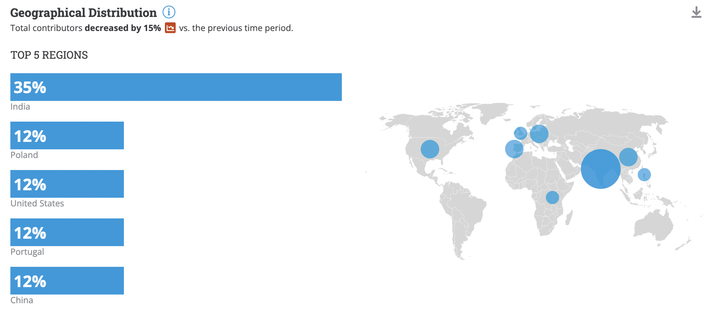

[//]: # (SPDX-License-Identifier: CC-BY-4.0)

# 2024 Q2 Hyperledger Cacti

## Project Health

- The project is in good health.
- We've added a new maintainer from a different organization (making a total of 4), increasing diversity in the process.
- We have been working primarily in maintenance mode, refactoring code and optimizing testing processes, ensuring stability in readiness for upcoming releases.
- We made strides toward interoperability protocol standardization by implementing the candidate IETF SATP specification using different combinations of Cacti modules.
- We got a major platform upgrade task approved for the Hyperledger Mentorship program in 2024.

# Questions/Issues for the TOC

None at the moment.

# Releases

No new releases. Latest is 2.0.0-alpha.2 (2023-09-27).

# Overall Activity in the Past Quarter

The last quarter had less activity, with 40 contributors, 111 commits, 90 issues, 142 pull requests, 14 forks, and 13 stars. The accumulated activity raises the project commits to 3,680. Average waiting time for first review on PRs has settled around 1 day.

# Current Plans

- The [Secure Asset Transfer Protocol (SATP)](https://datatracker.ietf.org/wg/satp/about/), hosted at the IETF, had its first open-source implementation completed within Cacti.
  * One of its flavors, SATP-Hermes, has a comprehensive roadmap opened as issues: [https://github.com/hyperledger/cacti/issues?q=is%3Aissue+is%3Aopen+label%3AIETF-SATP-Hermes](https://github.com/hyperledger/cacti/issues?q=is%3Aissue+is%3Aopen+label%3AIETF-SATP-Hermes). It includes implementing SATP to support Besu, Fabric, and EVM chains, as well as providing enterprise-grade features.
  * The other flavor is based on Cacti relays acting as decentralized SATP gateways, and is currently a PR under review: [https://github.com/hyperledger/cacti/pull/3001](https://github.com/hyperledger/cacti/pull/3001). A sample (reference) asset transfer instance has been implemented for two Fabric networks.
  * We will demonstrate how to test, use, and augment these features in a workshop on May 23 organized by Sean Bohan.
- Using the Hyperledger Mentorship program ([Cacti: Core Operators Modules for DLTs](https://wiki.hyperledger.org/display/INTERN/Cacti%3A+Core+Operators+Modules+for+DLTs)), we will continue the process of building a comprehensive architecture for integration and interoperability of DLT systems by extracting and offering a canonical set of core operators within Cacti over which different protocols can be engineered. This will result in a significant integration of legacy packages (from Cactus and Weaver), elimination of redundancies, and the creation of a common API.
- Using the Hyperledger Mentorship program ([Enabling Enterprise Organizational Blockchain Interoperability](https://wiki.hyperledger.org/display/INTERN/Enabling+Enterprise+Organizational+Blockchain+Interoperability)), we will continue our research on creating robust consortia that adhere to privacy and security needs, required by organizations leveraging our open-source project.

# Maintainer Diversity

- New maintainer from Instituto Superior Técnico, Universidade de Lisboa and INESC-ID, and Blockdaemon, Rafael Belchior: [https://github.com/hyperledger/cacti/pull/3075](https://github.com/hyperledger/cacti/pull/3075).

# Contributor Diversity

- https://lfanalytics.io/projects/hyperledger%2Fcactus/dashboard
- New contributors from Instituto Superior Técnico, Universidade de Lisboa and INESC-ID, working on the plugin SATP-Hermes, in the context of Blockchain.PT project. Projects they are working on are linked below: 
  * [https://github.com/orgs/hyperledger/projects/39](https://github.com/orgs/hyperledger/projects/39)
  * [https://github.com/orgs/hyperledger/projects/40](https://github.com/orgs/hyperledger/projects/40)
  * [https://github.com/orgs/hyperledger/projects/42](https://github.com/orgs/hyperledger/projects/42)
- In the last quarter, we had 111 commits from 40 contributors.
- Although the number of total contributors decreased, the geographical distribution increased.
  

# Additional Information

- N/A
