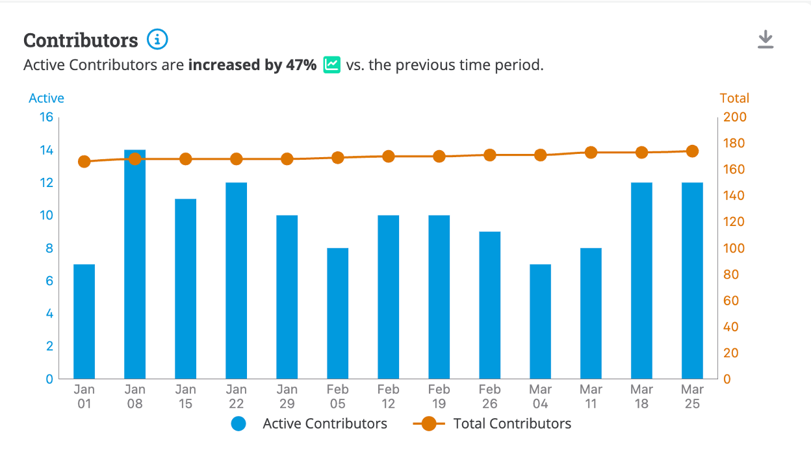
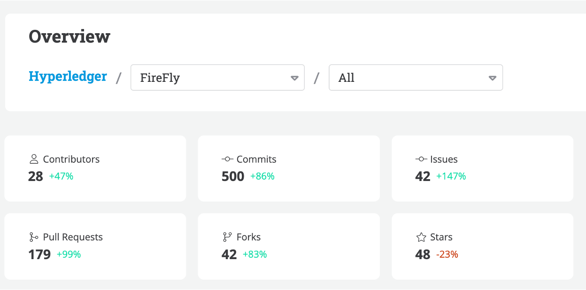

# Project Health

Hyperledger FireFly successfully launched [V1.3](https://www.hyperledger.org/blog/hyperledger-firefly-v1.3-is-now-available) this quarter. This is a significant upgrade that makes the industry’s first open-source Web3 Gateway an even more powerful platform for tokenization, multi-chain interoperability, and building blockchain-based applications.

FireFly continues to expand its maintainer base and diversity with 3 new maintainers this quarter. New maintainers include Enrique Lacal from Kaleido, Sam May from Kaleido, and Alexey Semenyuk from Instinct Tools.

In addition, FireFly continues to power many use cases in the digital assets community and remains a leader in enterprise middleware.

### Community adoption updates

- [SWIFT CBDC Phase 2](https://www.swift.com/sites/default/files/files/swift_cbdc_sandbox_project_results_report_phase2_final_220324.pdf)
  - Hyperledger Firefly was used to facilitate interoperability in the world’s largest CBDC industry collaboration to date.
  - Interoperability was tested between 38 different banks across chains running Besu, Fabric, and Corda.
  - Networks included 7 simulated CBDC networks, a foreign exchange network, a digital asset network, and a simulated CLS application, representing a mix of digital and traditional networks.

Community members have given talks featuring Hyperledger FireFly at a number of events including:

- Consensus 2024 where Hyperledger FireFly members presented at the Hyperledger booth
- Hyperledger Member Webinar: [Streamlining Delivery-versus-Payment with Hyperledger Technologies](https://www.youtube.com/watch?v=gnZOXHBsVdk&t=2737s)
- Duke Web3 Conference: [Real World Asset Tokenization](https://www.dukeweb3conference.com/speakers)
- Token 2049: [Decentralized Trust & Web3 in the Enterprise](https://lu.ma/lxjqfuw3?hss_channel=lcp-10851358)
- University of Southampton Business School lecture: [Web3 in Industry](https://www.linkedin.com/feed/update/urn:li:activity:7196499141403856896)
- [FireFly 1.3 webinar](https://www.meetup.com/hyperledger-raleigh/events/301138155/) scheduled for 6/10

### Contributor activity updates

The star activity for the FireFly repository has continued to grow from 430 end of last quarter to 481 end of this quarter. Discord activity remains consistent with ~45 DAU.

Contributors are active in the project and since March, there were 19 new contributors who performed at least one commit.
There are currently over 770k lines of code for Hyperledger FireFly across 20 repositories, with a total of 10.482k commits to date.

# Questions/Issues for the TOC

None

# Releases

## [FireFly v1.3](https://github.com/hyperledger/firefly/releases/tag/v1.3.0)
FireFly v1.3 new features include:
- Namespace Isolation: Isolated event streams added per namespace, improving replay functionality and availability without breaking changes.
- Invoke with Data: FireFly now supports custom smart contracts with data association, enhancing customization and enabling the ability to associate an off-chain data payload and pin it on a custom contract.
- Transaction Manager Performance: Support for PostgreSQL boosts transaction management performance and provides rich query APIs for better integration and diagnosis.
- Enhanced Performance with Besu: FireFly v1.3 optimizes integration with Hyperledger Besu, improving transaction coordination and state management for enterprise finance applications.
- Tezos Connector: New Tezos connector enables remote transaction signing and integration with key management solutions for decentralized applications on Tezos.

# Overall Activity in the Past Quarter

The major highlights have been detailed at the beginning of the report. In summary, there has been a lot of activity in the project. New community members continue to discover the project and make contributions. This quarter has seen the most significant new contribution from outside the set of the original maintainers, in the form of an entirely new blockchain connector. Additionally, FireFly 1.3 was released

# Current Plans

As part of our annual report, we listed the following goals for 2024.
- Release FireFly v1.3 (Q1) - This has been completed this quarter.
- Host another in-depth workshop to get even more developers hands on with FireFly - An in-depth workshop is being planned and scheduled for the end of Q3 2024.
- Continue to increase diversity of maintainers - FireFly has added three 3 new maintainers this quarter across 2 organizations.

# Maintainer Diversity

FireFly now has 14 maintainers representing three different companies:

- [Kaleido](https://kaleido.io/)
- [Fidelity](https://www.fidelity.com/)
- [OneOf](https://www.oneof.com/)

It is worth noting that each company has at least one maintainer who is a subject matter expert on one or more specific blockchain connectors, and the most foundational parts of the FireFly technology stack.

A list of all maintainers for Hyperledger FireFly may be found [here](https://wiki.hyperledger.org/display/FIR/Maintainers).

# Contributor Diversity

In the past quarter we’ve seen an increase in contributor strength, commit growth, and new contributors from parties outside of Kaleido.

[Commit Activities](https://insights.lfx.linuxfoundation.org/projects/hyperledger%2Ffirefly/dashboard;subTab=technical;v=source-control%2Fcommits%2Foverview)

# Additional Information

No additional information
