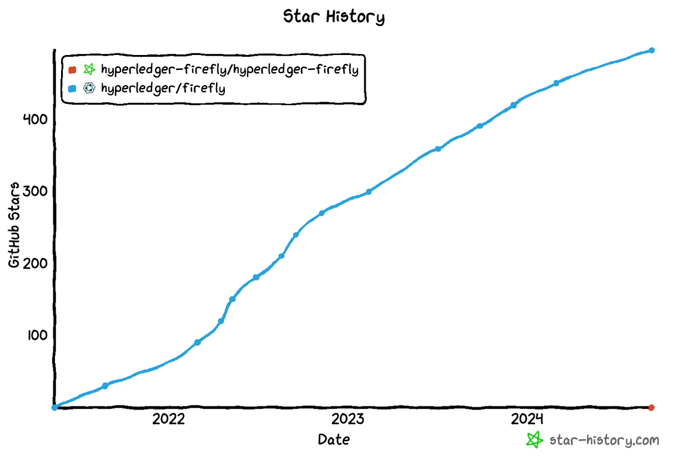
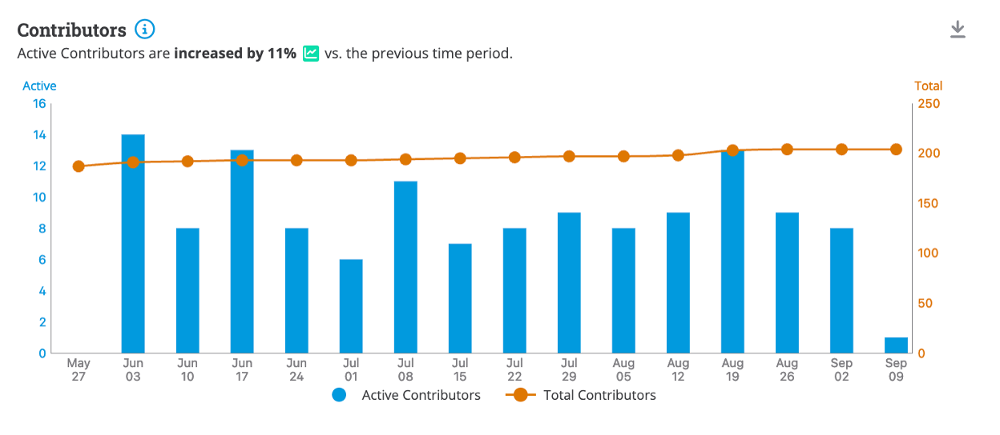
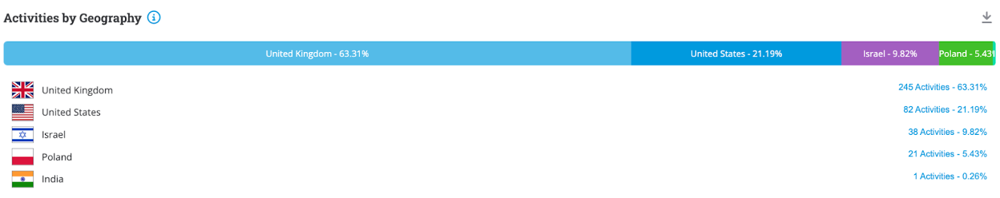
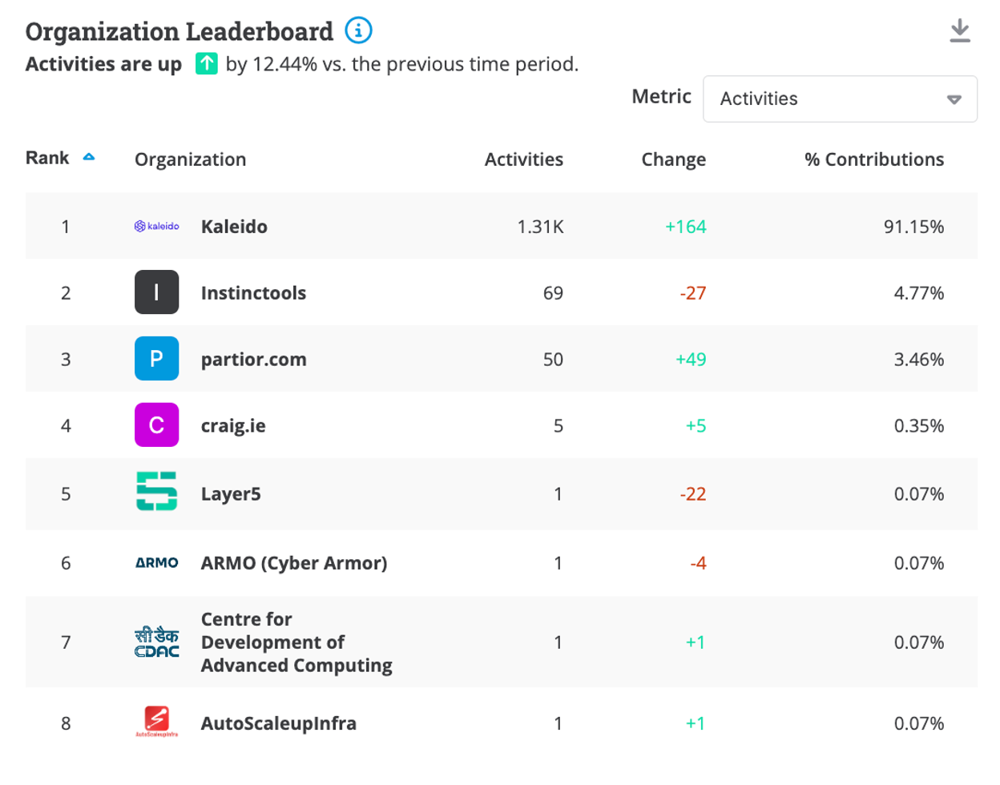
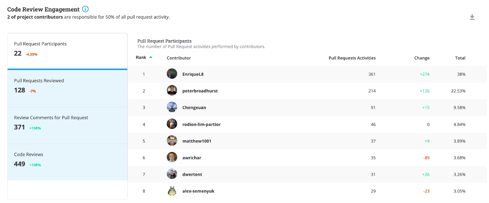

# Project Health

FireFly continues to be actively developed with the release of v1.3.1 this quarter. The release of 1.3.1 includes the following new features and enhancements.

__New Features__

- __Support for Contract Listeners with Multiple Event Filters:__ FireFly now supports contract listeners that can listen to multiple types of blockchain events. This is a substantial improvement that has been carefully thought through to be backwards compatible.

__Updates__

- __Improved Documentation:__ Missing documentation and README files have been added, including updates to doc links.
- __Multiparty Status API:__ A new API was added for managing multiparty transaction status.
- __Ethereum Blank Signing Key Support:__ Queries on Ethereum can now allow blank signing keys.
- __Enhanced Listener Management:__ When re-creating listeners in EVMConnect, EthConnect, or FabConnect, the last event block is now used to prevent duplicate handling.
- __Namespace Management:__ Fixes related to preventing multiple blockchain plugins from starting on namespace retry.
- __Websocket Enhancements:__ Websockets are now available as an option to communicate with EVM nodes in addition to RPC calls.
- __Performance:__ Event indexing optimized and bugs fixed to ensure that events and transactions are received and in the correct order.
- __Receipt Confirmation:__ Improved the receipt confirmations logic from the chain for EVM.

### Community adoption updates

This quarter, we have also seen increased activity from Partior who have contributed significantly to the FireFly CLI and EVMConnect.

Community members have given talks featuring Hyperledger FireFly at a number of events including:

- Hyperledger Member Webinar: [Hyperledger FireFly 1.3 Whats New & Whats Next](https://www.youtube.com/watch?v=zR_JwW1V9Og)
- Hyperledger Maintainer Days attendance scheduled for October 21st, 2024

### Contributor activity updates

The star activity for the FireFly repository has continued to grow from 481 end of last quarter to 496 end of this quarter. Discord activity has been very high this quarter with ~50 DAU.

Contributors are active in the project and since June, there were 39 contributors who performed at least one commit.
There are currently over 775k lines of code for Hyperledger FireFly across 20 repositories, with a total of 10.861k commits to date.

# Questions/Issues for the TOC

None

# Releases

This quarter, FireFly v1.3.1 was released with FireFly v1.3.2 upcoming next quarter. A high level overview of what’s new is below:

## [FireFly v1.3.2 pre-release](https://github.com/hyperledger/firefly/releases/tag/v1.3.2-rc.1)

FireFly v1.3.2 pre-release features includes the ability to install the FireFly CLI through Brew, a package manager for MacOS, bug fixes, documentation updates, and FireFly dependency updates. Look for a full update next quarter.

## [FireFly v1.3.1](https://github.com/hyperledger/firefly/releases/tag/v1.3.1)

FireFly v1.3 new features include:
- Multi-filters per listeners: Added the ability to listen to multiple types of events on the same contract listener.
- New Listener Type: Block listeners are added to stream receipts of block confirmations in the order that they are confirmed on the blockchain.
- Improved Documentation: Missing documentation and README files have been added, including updates to doc links.
- Multiparty Status API: A new API was added for managing multiparty transaction status.
- Ethereum Blank Signing Key Support: Queries on Ethereum can now allow blank signing keys.
- Enhanced Listener Management: When re-creating listeners in EVMConnect, EthConnect, or FabConnect, the last event block is now used to prevent duplicate handling.
- Namespace Management: Fixes related to preventing multiple blockchain plugins from starting on namespace retry.
- Websocket Enhancements: Websockets are now available as an option to communicate with EVM nodes in addition to RPC calls.
- Performance: Event indexing optimized and bugs fixed to ensure that events and transactions are received and in the correct order.
- Receipt Confirmation: Improved the receipt confirmations logic from the chain for EVM.

For a full list of changes and updates, please visit [the FireFly Github](https://github.com/hyperledger/firefly/releases/tag/v1.3.1).

# Overall Activity in the Past Quarter

The major highlights have been detailed at the beginning of the report. In summary, there has been a lot of activity in the project. New community members continue to discover the project and make contributions. This quarter we have continued to see contribution and activities from outside the set of the original maintainers. A new Cardano Connector has been discussed to be in development by an external party.

# Current Plans

As part of our annual report, we listed the following goals for 2024.

- Release FireFly v1.3 (Q1) - This has been completed last quarter.
- Host another in-depth workshop to get even more developers hands on with FireFly - An in-depth workshop is being planned and scheduled for Q1 2025.
- Continue to increase diversity of maintainers - No new maintainers this quarter however FireFly has added three 3 new maintainers across 2 organizations since the beginning of the year.

# Maintainer Diversity

FireFly now has 14 maintainers representing three different companies:

- [Kaleido](https://kaleido.io/)
- [Fidelity](https://www.fidelity.com/)
- [OneOf](https://www.oneof.com/)

It is worth noting that each company has at least one maintainer who is a subject matter expert on one or more specific blockchain connectors, and the most foundational parts of the FireFly technology stack.

A list of all maintainers for Hyperledger FireFly may be found [here](https://wiki.hyperledger.org/display/FIR/Maintainers).

# Contributor Diversity

In the past quarter we’ve seen an increase in contributor strength and new contributors from parties outside of Kaleido.

[Commit Activities](https://insights.lfx.linuxfoundation.org/foundation/lf-decentralized-trust/overview/github?project=firefly&repository=&routedFrom=Github)

# Additional Information

No additional information