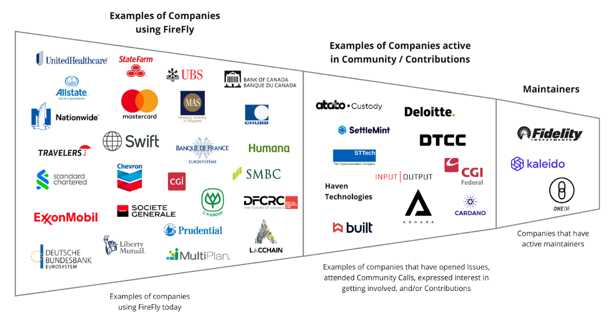

# Project Health

Hyperledger FireFly released version 1.2 and achieved graduated status in 2023. Contributors increased by 7%. FireFly is in a more mature and stable state than when V1.0 was released in 2022 with adoption from dozens of large enterprises across a variety of industries. As a result there were fewer commits than in 2022.

[LFX Insights report for 2023](https://insights.lfx.linuxfoundation.org/foundation/hyp/overview?project=firefly&bestPractice=false&repository=all&dateFilters=Last%20Year&dateRange=2023-01-01%20to%202023-12-31&compare=PP&granularity=month&hideBots=true)
Highlights from the 2023 Insights report:

- 81 contributors (+7% from 2022)
- 1573 commits
- 58% of code activities were performed by 3 people (from Kaleido)
- 85% of code activities were performed by 1 organization (Kaleido)
- There were a total of 36 organizations and 117 contributors
- The top five regions activity include:
  - United States (29%)
  - UK (17%)
  - India (8%)
  - Brazil (7%)
  - Nigeria (5%)

# Maintainer Diversity

FireFly now has 12 maintainers representing three different companies:

- [Kaleido](https://kaleido.io/)
- [Fidelity](https://www.fidelity.com/)
- [OneOf](https://www.oneof.com/)

It is worth noting that each company has at least one maintainer who is a subject matter expert on one or more specific blockchain connectors, and the most foundational parts of the FireFly technology stack.

- Kaleido: core architecture
- Fidelity: connectivity and transaction model with the Ethereum protocol
- OneOf: connectivity and transaction model with the Tezos protocol

A list of all maintainers for Hyperledger FireFly may be found [here](https://wiki.hyperledger.org/display/FIR/Maintainers).

# Project Adoption

Hyperledger FireFly continues to be adopted by world leading companies throughout the world. Fidelity, Deloitte, DTCC, Atato, CGI Federal, and more are just some of the names who have taken either a maintainer role or are actively contributing to the community. Examples of top enterprises using FireFly include SWIFT, Allstate, ExxonMobil, Nationwide, Humana, Mastercard, and more.

# Goals

## Performance Against Prior Goals

2023 goals:

- Achieve graduated status (COMPLETED)
- Release at least one significant feature release (COMPLETED)
- Include at least one new, non-EVM connector in the project (COMPLETED)
- Achieve maintainer representation from at least three companies (COMPLETED)

Noteworthy accomplishments in 2023:

- Release of FireFly V1.2
- Delivery of the [Tezos connector](https://github.com/hyperledger/firefly-tezosconnect).

## Next Year's Goals

2024 goals:

- Release FireFly v1.3 (Q1)
- Host another in-depth workshop to get even more developers hands on with FireFly
- Planning around FireFly 2.0
- Continue to increase diversity of maintainers

## Help Required

Work with the TOC and Hyperledger staff to Identify and connect potential maintainers for Hyperledger FireFly outside of Kaleido

# Project Lifecycle Stage Recommendation

We think the graduated status continues to be appropriate for Hyperledger FireFly, given its wide range of adoption and involvement in some of the prominent use cases in enterprise blockchain. It’s also actively evolving based on community feedback.
